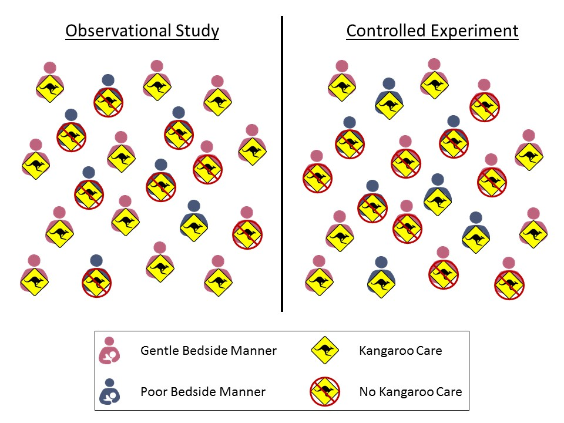

# Gathering the Evidence (Data Collection) {#Data}

Consider again the goal of statistical inference --- to use a sample as a snapshot to say something about the underlying population (Figure \@ref(fig:data-statistical-process)).  This generally provokes unease in people, leading to a distrust of statistical results.  In this section we attack that distrust head on.  

```{r data-statistical-process, echo=FALSE, ref.label="basics-statistical-process", fig.cap="Illustration of the statistical process (reprinted from Chapter 1)."}
```


## What Makes a Sample Reliable
If we are going to have some amount of faith in the statistical results we produce, we must have data in which we can place our trust.  _The Treachery of Images_ (Figure \@ref(fig:data-pipe-img)) is a canvas painting depicting a pipe, below which the artist wrote the French phrase "This is not a pipe."  Regarding the painting, the artist said

  > The famous pipe.  How people reproached me for it!  And yet, could you stuff my pipe?  No, it's just a representation, is it not?  So if I had written on my picture "This is a pipe," I'd have been lying!

(ref:figcap-data-pipe-img) _The Treachery of Images_ by Ren&eacute; Magritte.

```{r data-pipe-img, echo=FALSE, fig.cap="(ref:figcap-data-pipe-img)"}
knitr::include_graphics("./images/Data-Pipe.jpg")
```

Just as a painting is a representation of the object it depicts, so a sample should be a representation of the population under study.  This is the primary requirement if we are to rely on the resulting data.  

```{block2, type="rmdkeyidea"}
In order for a statistical analysis to be reliable, the sample must be _representative_ of the population under study.
```

We need to be careful to not get carried away in our expectations.  What constitutes "representative" really depends on the question, just as an artist chooses his depiction based on how he wants to represent the object.  Let's consider the following example.

```{example, label=data-school-debt, name="School Debt"}
In addition to a degree, college graduates also tend to leave with a large amount of debt due to college loans.  In 2012, a graduate with a student loan had an average debt of $29,400; for graduates from private non-profit institutions, the average debt was $32,300[^debt].

Suppose we are interested in determining the average amount of debt in student loans carried by a graduating senior from Rose-Hulman Institute of Technology, a small private non-profit engineering school.  There are many faculty at Rose-Hulman who choose to send their children to the institute.  Since I am also on the faculty, I know many of these individuals.  Suppose I were to ask each to report the amount of student loans their children carried upon graduation from Rose-Hulman.  I compile the 25 responses and compute the average amount of debt.  Further, I report that based on this study, there is significant evidence that the average debt carried by a graduate of Rose-Hulman is far below the $32,300 reported above (great news for this year's graduating class)!  Why might we be hesitant to trust these results?
```

Many objections to statistical results stem from a distrust of whether the data (the sample) is really representative of the population of interest.  Rose-Hulman, like many other universities, has a policy that the children of faculty may attend their university (assuming admittance) tuition-free.  We would therefore expect their children to carry much less debt than the typical graduating senior.  There is a mismatch between the group we would like to study and the data we have collected.

This example provides a nice backdrop for discussing what it means to be representative.  First, let's define our population; in this case, we are interested in graduating seniors from Rose-Hulman.  The variable of interest is the amount of debt carried in student loans; the parameter of interest is then the _average_ amount of debt in student loans carried by graduating seniors of Rose-Hulman.  However, the sample consists of only graduating seniors of Rose-Hulman who have a parent employeed by the university.

With regard to the grade point average of the students in our sample, it is probably similar to all graduating seniors.  The starting salary of the students in our sample is probably similar to all graduating seniors; the fraction of mechanical engineering majors versus math majors is probably similar.  So, in many regards the sample is representative of the population; however, it fails to be representative with regard to the variable of interest.  This is our concern.  The amount of debt carried by students in our sample is not representative of that debt carried by all graduating seniors from the university.

```{block2, type="rmdtip"}
When thinking about whether a sample is representative, focus your attention to the characteristics specific to your research question.
```

Does that mean the sample is useless?  Yes and no.  The sample collected cannot be used to answer our initial question of interest.  No statistical method can fix bad data; statistics adheres to the "garbage-in, garbage-out" phenomena.  If the data is bad, no analysis will undo that.  However, while the sample cannot be used to answer our initial question, it could be used to address a different question:

  > What is the average amount of debt in student loans carried by graduating seniors from Rose-Hulman whose parent is a faculty member at the university?

For this revised question, the sample may indeed be representative.  If we are working with previously collected data, we must consider the population to which our results will generalize.  That is, for what population is the given sample representative?  If we are collecting our data, we need to be sure we collect data in such a way that the data is representative of our target population.  Let's first look at what _not_ to do.


## Poor Methods of Data Collection
Example \@ref(ex:data-school-debt) is an example of a "convenience sample," when the subjects in the sample are chosen simply due to ease of collection.  Examples include surveying students only in your sorority when you are interested in all females who are part of a sorority on campus; taking soil samples from only your city when you are interested in the soil for the entire state; and, obtaining measurements from only one brand of phone, because it was the only one you could afford on your budget, when you are interested in studying all cell phones on the market.  A convenience sample is unlikely to be representative if there is a relationship between the ease of collection and the variable under study.  This was true in the School Debt example; the relationship of a student to a faculty member was directly related to the amount of debt they carried.  As a result, the resulting sample was not representative of the population.

When conducting a survey with human subjects, it is common to only illicit responses from volunteers.  Such "volunteer samples" tend to draw in those with extreme opinions.  Consider product ratings on Amazon.  Individual ratings tend to cluster around 5's and 1's.  This is because those customers who take time to submit a review (which is voluntary) tend to be those who are really thrilled with their product (and want to encourage others to purchase it) and those who are really disappointed with their purchase (and want to encourage others to avoid it).  Such surveys often fail to capture those individuals in the population who have "middle of the road" opinions.

We could not possibly name all the poor methods for collecting a sample; but, poor methods all share something in common --- it is much more likely the resulting sample is not representative.  Failing to be representative results in __biased__ estimates of the parameter.

```{definition, label=defn-bias, name="Bias"}
A set of measurements is said to be biased if they are _consistently_ too high (or too low).  Similarly, an estimate of a parameter is said to be biased if it is _consistently_ too high (or too low).
```

To illustrate the concept of bias, consider shooting at a target as in Figure \@ref(fig:data-bias).  We can consider the center of our target to be the parameter we would like to estimate within the population.  The values in our sample (the strikes on the target) will vary around the parameter; while we do not expect any one value to hit the target precisely, a "representative" sample is one in which the values tend to be clustered about the parameter (unbiased).  When the sample is not representative, the values in the sample tend to cluster off the mark (biased).  Notice that to be unbiased, it may be that not a single value in the sample is perfect, but aggregated together, they point in the right direction.  So, bias is not about an individual measurement being an "outlier," (more on those in a later chapter) but about repeatedly shooting in the wrong direction.

```{r data-bias, echo=FALSE, fig.cap="Illustration of bias and variability."}
knitr::include_graphics("./images/Data-Bias.jpg")
```

```{block2, type="rmdkeyidea"}
Biased results are typically due to poor sampling methods that result in a sample which is not representative of the target population.
```

The catch (there is always a catch) is that we will never _know_ if a sample is actually representative or not.  We can, however, employ methods that help to minimize the chance that the sample is biased.


## Preferred Methods of Sampling
No method guarantees a perfectly representative sample; but, we can take measures to reduce or eliminate bias.  A useful strategy is to employ _randomization_.  This is summarized in our second Fundamental Idea:

```{block2, type="rmdfivefund"}
__Fundamental Idea II__: If data is to be useful for making conclusions about the population, a process referred to as drawing inference, proper data collection is crucial.  Randomization can play an important role ensuring a sample is representative and that inferential conclusions are appropriate.
```

Consider the School Debt example again.  Suppose instead of the strategy described there, we had done the following:

  > We constructed a list of all graduating seniors from the university.  We placed the name of each student on an index card; then, we thoroughly shuffled the cards and chose the top 25 cards.  For these 25 individuals, we recorded the amount of debt in student loans each carried.  
  
This essentially describes using a lottery to select the sample.  This popular method is known as taking a __simple random sample__.  By conducting a lottery, we make it very unlikely that our sample consists of only students with a very small amount of student debt (as occurred when we used a convenience sample).

```{definition, label=defn-simple-random-sample, name="Simple Random Sample"}
Often abbreviated SRS, this is a sample of size $n$ such that _every_ collection of size $n$ is equally likely to be the resulting sample.  This is equivalent to a lottery.
```

There are situations in which a simple random sample does not suffice.  Again, consider our School Debt example.  The Rose-Hulman student body is predominantly domestic, with only about 3% of the student body being international students.  But, suppose we are interested in comparing the average debt carried between international and domestic students.  It is very likely, by chance alone, that in a simple random sample of 25 students none will be international.  Instead of a simple random sample, we might consider taking a sample of 13 domestic students and a sample of 12 international students; this is an example of a __stratified random sample__.  This approach is useful when there is a natural grouping of interest within the population.

```{definition, label=defn-stratified-random-sample, name="Stratified Random Sample"}
A sample in which the population is first divided into groups, or strata, based on a characteristic of interest; a simple random sample is then taken within each group.
```

There are countless sampling techniques used in practice.  The two described above can be very useful starting points for developing a custom method suitable for a particular application.  Their benefit stems from their use of randomization.

This section is entitled "Preferred Methods" because while these methods are ideal, they are not always practical.  Consider the [Deepwater Horizon Case Study](#CaseDeepwater); conceptually, we can take a simple random sample of the volunteers for our study.  However, as with any study involving human subjects, researchers would be required to obtain consent from each subject in the study.  That is, a volunteer has the right to refuse to participate in the study.  Therefore, it is unlikely that a simple random sample as described above could be obtained.  Again, the key is to obtain a _representative_ sample; while random selection may be a nice tool for accomplishing this, we may need to appeal to the composition of the sample itself to justify its use.  _Based on the characteristics of those willing to participate in the study, do we feel the study participants form a representative group of all volunteers?_  That is the essential question.  This is often why studies report a table summarizing subject demographics such as age, gender, etc.  It is also why it is extremely important for researchers to describe how subjects were selected so that readers may make the judgement for themselves whether the sample is representative.


## Two Types of Studies
Thinking about how the data was collected helps us determine how the results generalize beyond the sample itself (to what population the results apply).  When our question of interest is about the relationship between two variables (as most questions are), we must also carefully consider the study design.  Too often separated from the statistical analysis that follows, keeping the study design in mind should guide the analysis as well as inform us about the conclusions we can draw.

In order to illustrate how study design can impact the results, consider the following example.

```{example, label=data-kangaroo, name="Kangaroo Care"}
At birth, infants have low levels of Vitamin K, a vitamin needed in order to form blood clots.  Though rare, without the ability for her blood to clot, an infant could develop a serious bleed.  In order to prevent this, the American Academy of Pediatrics recommends that all infants be given a Vitamin K shot shortly after birth in order to raise Vitamin K levels.  As with any shot, there is typically discomfort to the infant, which can be very discomforting to new parents.

Kangaroo Care is a method of holding a baby which emphasizes skin-to-skin contact.  The child, who is dressed only in a diaper, is placed upright on the parent's bare chest; a light blanket is draped over the child.  Suppose we are interested in determining if utilizing the method while giving the child a Vitamin K shot reduces the discomfort in the infant, as measured by the total amount of time the child cries following the shot.  Contrast the following two potential study designs:

  (A)  We allow the attending nurse to determine whether Kangaroo Care is initiated prior to giving the Vitamin K shot.  Following the shot, we record the total time (in seconds) the child cries.
  (B)  We flip a coin.  If it comes up heads, the nurse should have the parents implement Kangaroo Care prior to giving the Vitamin K shot; if it comes up tails, the nurse should give the Vitamin K shot without implementing Kagaroo Care.  Following the shot, we record the total time (in seconds) the child cries.

Note, in both study designs (A) and (B), we only consider term births which have no complications to avoid situations that might alter the timing of the Vitamin K shot or the ability to implement Kangaroo Care.
```

Note that there are some similarities in the two study designs:

  - The underlying population is the same for both designs --- infants born at term with no complications.
  - There are two groups being compared in both designs --- the "Kangaroo Care" group and the "no Kangaroo Care" group.
  - The response (variable of interest) is the same in both designs --- the time (in seconds) the infant cries.
  - There is action taken by the researcher in both designs --- a Vitamin K shot is given to the child.

There is one prominent difference between the two study designs:

  - For design (A), the choice of Kangaroo Care is left up to the nurse (self-selected); for design (B), the choice of Kangaroo is _assigned_ to the nurse by the researcher, and this selection is made _at random_.

Design (A) is an example of an __observational study__; design (B) is a __controlled experiment__.

```{definition, label=defn-observational-study, name="Observational Study"}
A study in which each subject "self-selects" into one of groups being compared in the study.  The phrase "self-selects" is used very loosely here and can include studies in which the groups are defined by an inherit characteristic or the groups are chosen haphazardly.
```

```{definition, label=defn-controlled-experiment, name="Controlled Experiment"}
A study in which each subject is _randomly_ assigned to one of the groups being compared in the study.
```

It is common to think that anytime the environment is "controlled" by the researcher that a controlled experiment is taking place, but the defining characteristic is the random assignment to groups (sometimes referred to as the _factor_ under study or _treatment_ groups).  In the example above, both study designs involved a controlled setting (the delivery room of a hospital) in which trained staff (the nurse) deliver the shot.  However, only design (B) is a controlled experiment because the researchers randomly determined into which group the infant would be placed.

To understand the impact of random allocation, suppose that we had conducted a study using design (A); further, the results suggest that those infants who were given a shot while using Kangaroo Care cried for a shorter time period, on average.  Can we conclude that it was the Kangaroo Care that led to the shorter crying time?  Maybe.  Consider the following two potential explanations for the resulting data:

  (1)  Kangaroo Care is very effective; as a result, those children who were given Kangaroo Care had reduced crying time, on average, following the Vitamin K shot.
  (2)  It turns out that those nurses who chose to implement Kangaroo Care (remember, they have a choice under design (A) whether they implement the method) were also the nurses with a gentler bedside manner.  Therefore, these nurses tended to be very gentle when giving the Vitamin K shot whereas the nurses who chose not to implement Kangaroo Care tended to just jab the needle in when giving the shot.  As a result, the reduced crying time is not a result of the Kangaroo Care but the manner in which the shot was given.
  
The problem is that we are unable to determine which of the explanations is correct.  Given the data we have collected, we are unable to tease out the effect of the Kangaroo Care from that of the nurse's bedside manner.  As a result, we are able to say we observed an _association_ between the use of Kangaroo Care and reduced crying time, but we are unable to conclude that Kangaroo Care _caused_ a reduction in the crying time (that is, there may not be a _relationship_ between the two variables).  In this hypothetical scenario, the nurse's bedside manner is called a __confounder__.

```{definition, label=defn-confounding, name="Confounding"}
When the effect of a variable on the response is mis-represented due to the presence of a third, potentially unobserved, variable known as a confounder.
```

Confounders can mask the relationship between the factor under study and the response.  There is a documented association between ice cream sales and the risk of shark attacks.  As ice cream sales increase, the risk of a shark attack also tends to increase.  This does not mean that if a small city in the Midwest increases its ice cream sales that the citizens are at higher risk of being attacked by a shark.  As Figure \@ref(fig:data-confounding) illustrates, there is a confounder --- temperature.  As the temperatures increase, people tend to buy more ice cream; as the temperature increases, people tend to go to the beach increasing the risk of a shark attack.  Two variables can appear to be related as a result of a confounder.

```{r data-confounding, echo=FALSE, fig.cap="Illustration of a confounding variable. The confounder, related to both the factor and the treatment can make it appear as though there is a causal relationship when none exists."}
knitr::include_graphics("./images/Data-Confounding.jpg")
```

```{block2, type="rmdtip"}
Confounders are variables that influence _both_ the factor of interest and the response.
```

Observational studies are subject to confounding; thus, controlled experiments are often considered the gold standard in research because they allow us to infer cause-and-effect relationships from the data.  Why does the random allocation make such an impact?  Because it removes the impact of confounders.  Let's return to the hypothetical Vitamin-K study.  Suppose there are nurses with a gentle bedside manner and those who are a little less gentle.  If the infants are randomly assigned to one of the two treatment groups, then for every gentle nurse who is told to implement Kangaroo Care while giving the shot, there tends to be a gentle nurse who is told to not implement Kangaroo Care.  Similarly, for every mean nurse who is told to implement Kangaroo Care while giving a shot, there tends to be a mean nurse who is told to not implement Kangaroo Care.  This is illustrated in Figure \@ref(fig:data-randomization).  For an observational study, the treatment groups can be unbalanced; for example, the figure illustrates a case in which there is a higher fraction (11/12 compared to 1/4) of friendly nurses in the Kangaroo Care group compared to the No Kangaroo Care group.  For the controlled experiment however, the treatment groups tend to be balanced; there is approximately the same fraction of friendly nurses in both groups.  Random assignment is the great equalizer.  It tends to result in groups which are similar in all respects; therefore, any differences we observe between the groups _must_ be due to the grouping and not an underlying confounding variable.

```{r data-randomization, echo=FALSE, fig.cap="Illustration of the impact of random assignment in study design. For the observational study, the treatment groups are unbalanced.  For the controlled experiment, the treatment groups are balanced."}

```

```{block2, type="rmdkeyidea"}
Randomly assigning subjects to groups balances the groups with respect to any confounders; that is, the groups being compared are similar.  Therefore, any differences between the two groups can be attributed to the grouping factor itself, leading to cause-and-effect conclusions.
```

While controlled experiments are a fantastic study design, we should not discount the use of observational studies.  Consider the [Deepwater Horizon Case Study](#CaseDeepwater); suppose we are interested in the following question:

  > Is there evidence that volunteers who are directly exposed to oil have an increased risk of developing adverse respiratory symptoms compared to those who are not directly exposed to oil?
  
The response is whether a volunteer develops adverse respiratory symptoms; the factor of interest is whether the volunteer has direct exposure to oil.  We could conduct a controlled experiment by randomly determining which volunteers are assigned to wildlife clean up and which are assigned to administrative tasks, for example.  However, it may be that volunteer tasks need to be determined by skillset or by greatest need at the time the person volunteers.  It may not be feasible to randomly assign volunteers to specific positions.  Or, it could be that the data was obtained after the fact; that is, the data is not the result of a planned study in which case random assignment is not possible because volunteers self-selected into positions in the past.  If random assignment is not possible, it does not mean the data is useless.  But, it does mean we will need to be sure we address the potential confounding when performing the analysis and discussing the results.

The big idea is that in order to make causal conclusions, we must be able to state that the groups being compared are balanced with respect to any potential confounders; random assignment is one technique for accomplishing this.

[^debt]: http://ticas.org/sites/default/files/pub_files/Debt_Facts_and_Sources.pdf
