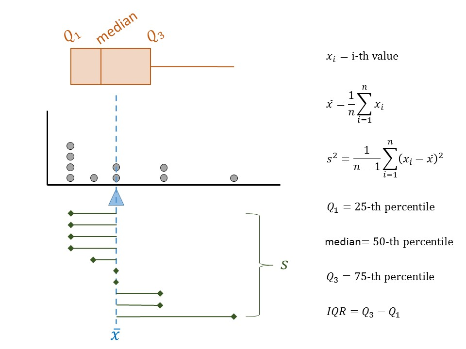

# Presenting the Evidence (Summarizing Data) {#Summaries}

If you open any search engine and look up "data visualization," you will quickly be overwhelmed by a host of pages, texts, and software filled with tools for summarizing your data.  Here is the bottom line: a good visualization is one that helps you answer your question of interest.  It is both that simple and that complicated.

```{block2, type="rmdfivefund"}
__Fundamental Idea III__: The use of data for decision making requires that the data be summarized and presented in ways that address the question of interest.
```

Whether simple or complex, all graphical and numerical summaries should help turn the data into usable information.  Pretty pictures for the sake of pretty pictures are not helpful.  In this section, we will consider various simple graphical and numerical summaries to help build a case for addressing the question of interest.


## Characteristics of a Distribution (Summarizing a Single Variable)
Remember that because of _variability_, the key to asking good questions is to not ask questions about individual values but to characterize the underlying _distribution_ (see Definition \@ref(def:defn-distribution)).  Therefore, characterizing the underlying distribution is also the key to a good visualization or numeric summary.  For the [Deepwater Horizon Case Study](#CaseDeepwater), the response (whether a volunteer experienced adverse respiratory symptoms) is categorical.  As we stated previously, summarizing the distribution of a categorical variable reduces to showing how individual subjects fall into the various groups.  Figure \@ref(fig:summaries-deepwater-barchart) displays a _bar chart_ summarizing the rate of respiratory symptoms for volunteers cleaning wildlife.

```{r summaries-deepwater-data, include=FALSE}
deepwater.df <- data_frame(
  Volunteer_Location = 
    factor(rep(c("Wildlife Cleanup", "No Oil Exposure"), each = 2),
           levels = c("Wildlife Cleanup", "No Oil Exposure"),
           ordered = TRUE),
  Respiratory_Symptoms = 
    factor(rep(c("Yes", "No"), times = 2),
           levels = c("No", "Yes"),
           ordered = TRUE),
  Frequency = c(15, 54-15, 16, 103-16),
  Rel_Frequency = c(15/54, (54-15)/54, 16/103, (103-16)/103)
)
```

```{r summaries-deepwater-barchart, echo=FALSE, fig.cap="Frequency of adverse respiratory symptoms for volunteers cleaning wildlife following the Deepwater Horizon oil spill."}

ggplot(data = filter(deepwater.df, Volunteer_Location=="Wildlife Cleanup"),
       mapping = aes(x = Respiratory_Symptoms, y = Frequency)) +
  geom_bar(stat = "identity") +
  geom_label(aes(label = Frequency)) +
  labs(x = "Adverse Respiratory Symptoms", y = "Number of Volunteers") +
  theme_bw(12)
```

In general, it does not matter whether the frequency or the relative frequencies are reported; however, if the relative frequencies are plotted, some indication of the sample size should be provided with the figure either as an annotation or within the caption.  From the above graphic, we see that nearly 28% of volunteers assigned to wildlife experienced adverse respiratory symptoms; the graphic helps address our question, even if not definitively.

```{block2, type="rmdtip"}
When you are summarizing only categorical variables, a bar chart is sufficient.  Statisticians tend to agree that bar charts are preferable to pie charts (see [this whitepaper](https://www.google.com/url?sa=t&rct=j&q=&esrc=s&source=web&cd=32&cad=rja&uact=8&ved=0ahUKEwjk6Lf42sfVAhVl64MKHaTdAFY4HhAWCC4wAQ&url=https%3A%2F%2Fwww.perceptualedge.com%2Farticles%2Fvisual_business_intelligence%2Fsave_the_pies_for_dessert.pdf&usg=AFQjCNFkS-sogmLsZIOheWAPBZSNcqjzkg) and [this blog](http://www.storytellingwithdata.com/blog/2014/06/alternatives-to-pies) for further explanation).
```

While a single type of graphic (bar charts) are helpful for looking at categorical data, summarizing the distribution of a numeric variable requires a bit more thought.  Consider the following example.

```{example, label=summaries-paper, name="Paper Strength"}
While electronic records have become the predominant means of storing information, we do not yet live in a paperless society.  Paper products are still used in a variety of applications ranging from printing reports and photography to packaging and bathroom tissue.  In manufacturing paper for a particular application, the strength of the resulting paper product is a key characteristic. 

There are several metrics for the strength of paper.  A conventional metric for assessing the inherent (not dependent upon the physical characteristics, such as the weight of the paper, which might have an effect) strength of paper is the _breaking length_.  This is the length of a paper strip, if suspended vertically from one end, that would break under its own weight.  Typically reported in kilometers, the breaking length is computed from other common measurements.  For more information on paper strength measurements and standards, see the following website: <http://www.paperonweb.com>

A study was conducted at the University of Toronto to investigate the relationship between pulp fiber properties and the resulting paper properties [@Lee1992].  The breaking length was obtained for each of the 62 paper specimens, the first 5 measurements of which are shown in Table \@ref(tab:summaries-paper-table).  The complete dataset is available online at the following website: <https://vincentarelbundock.github.io/Rdatasets/doc/robustbase/pulpfiber.html>

While there are several questions one might ask with the available data, here we are primarily interested in characterizing the breaking length of these paper specimens.
```

```{r summaries-paper-data, echo=FALSE}
# Obtain Data
paper.df <- read_csv("./data/pulpfiber.csv",
  col_names = c("Specimen",
                "Arithmetic_Fiber_Length",
                "Long_Fiber_Fraction",
                "Fine_Fiber_Fraction",
                "Zero_Span_Tensile",
                "Breaking_Length",
                "Elastic_Modulus",
                "Stress_at_Failure",
                "Burst_Strength"),
  col_types = "innnnnnnn",
  skip = 1
)
```

```{r summaries-paper-table, echo=FALSE}
# Print Table
#  Reduce to only show variable of interest.
paper.df %>%
  select(Specimen,
         `Breaking Length` = Breaking_Length) %>%
  slice(1:5) %>%
  knitr::kable(caption = "Breaking length (km) for first 5 specimens in the Paper Strength study.")
```

Figure \@ref(fig:summaries-paper-dotplot) presents the breaking length for all 62 paper specimens in the sample through a _dot plot_ in which the breaking length for each observed specimen is represented on a number line using a single dot.

```{r summaries-paper-dotplot, echo=FALSE, fig.cap="Breaking Length (km) for 62 paper specimens."}
ggplot(data = paper.df,
       mapping = aes(x = Breaking_Length)) +
  geom_dotplot(binwidth = 0.5, method = "histodot") +
  labs(x = "Breaking Length (km)") +
  theme_bw(12) +
  theme(axis.text.y = element_blank(),
        axis.title.y = element_blank(),
        axis.ticks.y = element_blank())
```

```{r summaries-paper-numeric, echo=FALSE}
# Measures of location and spread
bl.summaries <- paper.df %>%
  select(Breaking_Length) %>%
  summarise(Mean = mean(Breaking_Length),
            Median = median(Breaking_Length),
            Q25 = quantile(Breaking_Length, prob = c(0.25)),
            Q75 = quantile(Breaking_Length, prob = c(0.75)),
            Max = max(Breaking_Length),
            Min = max(Breaking_Length),
            SD = sd(Breaking_Length),
            Var = var(Breaking_Length),
            IQR = Q75 - Q25)
```

With any graphic, we tend to be drawn to three components:

  - _where_ the values tend to be, 
  - _how tightly_ the values tend to be clustered there, and
  - _the way_ the values tend to cluster.
  
Notice that about half of the paper specimens in the sample had a breaking length longer than `r round(bl.summaries$Median, 2)` km.  Only about 25% of paper specimens had a breaking length less than `r round(bl.summaries$Q25, 2)` km.  These are measures of _location_.  In particular, these are known as __percentiles__, of which the __median__, __first quartile__ and __third quartile__ are commonly used examples.

```{definition, label=defn-percentile, name="Percentile"}
The $k$-th percentile is the value $q$ such that $k$% of the values in the distribution are less than or equal to $q$.  For example,

  - 25% of values in a distribution are less than or equal to the 25-th percentile (known as the "first quartile" and denoted $Q_1$).
  - 50% of values in a distribution are less than or equal to the 50-th percentile (known as the "median").
  - 75% of values in a distribution are less than or equal to the 75-th percentile (known as the "third quartile" and denoted $Q_3$).

```

The __average__ is also a common measure of location.  The breaking length of a paper specimen is `r round(bl.summaries$Mean, 2)` km, on average.  In this case, the average breaking length and median breaking length are very close; this need not be the case.  The average is not describing the "center" of the data in the same way as the median; they capture different properties.

```{definition, label=defn-average, name="Average"}
Also known as the "mean," this measure of location represents the balance point for the distribution.  It is denoted by $\bar{x}$.  

For a sample of size $n$, it is computed by
$$\bar{x} = \frac{1}{n}\sum_{i=1}^{n} x_i$$

where $x_i$ rerpesents the $i$-th value in the sample.

When referencing the average for a population, the mean is also called the "Expected Value," and is often denoted by $\mu$.
```

Clearly, the breaking length is not equivalent for all paper specimens; that is, there is variability in the measurements.  Measures of _spread_ quantify the variability of values within a distribution.  Common examples include the __standard deviation__ (related to __variance__) and __interquartile range__.  For the Paper Strength example, the breaking length varies with a standard deviation of `r round(bl.summaries$SD, 2)` km; the interquartile range for the breaking length is `r round(bl.summaries$IQR, 2)` km.  

The standard deviation is often reported more often than the variance since it is on the same scale as the original data; however, as we will see later, the variance is useful from a mathematical perspective for derivations.  Neither of these values has a natural interpretation; instead, larger values of these measures simply indicate a higher degree of variability in the data.

```{definition, label=defn-variance, name="Variance"}
A measure of spread, this roughly captures the average distance values in the distribution are from the mean.

For a sample of size $n$, it is computed by
$$s^2 = \frac{1}{n-1}\sum_{i=1}^{n} \left(x_i - \bar{x}\right)^2$$

where $\bar{x}$ is the sample mean and $x_i$ is the $i$-th value in the sample.  The division by $n-1$ instead of $n$ reduces the bias in the statistic.

The symbol $\sigma^2$ is often used to denote the variance in the population.
```

```{definition, label=defn-standard-deviation, name="Standard Deviation"}
A measure of spread, this is the square root of the variance.
```

```{definition, label=defn-interquartile-range, name="Interquartile Range"}
The distance between the first and third quartiles.  This measure of spread indicates the range over which the middle 50% of the data is spread.
```

The measures we have discussed so far are illustrated in Figure \@ref(fig:summaries-summaries).  While some authors suggest the summaries you choose to report depends on the shape of the distribution, we argue that it is best to report the values that align with the question of interest.  It is the question that should be shaped by the beliefs about the underlying distribution.

```{r summaries-summaries, echo=FALSE, fig.cap="Illustration of measures of location and spread for a distribution of values."}

```

Finally, consider the _shape_ of the distribution of breaking length we have observed.  The breaking length tends to be clustered in two locations; we call this _bimodal_ (each mode is a "hump" in the distribution).  Other terms used to describe the shape of a distribution are _symmetric_ and _skewed_.  Symmetry refers to cutting a distribution in half (at the median) and the lower half being a mirror image of the upper half; skewed distributions are those which are not symmetric.

Observe then that the dot plot above gives us some idea of the location, spread, and shape of the distribution, in a way that the table of values could not.  This makes it a useful graphic as it is characterizing the __distribution of the sample__ we have observed.  This is one of the four components of what we call the _Distributional Quartet_.

```{definition, label=defn-distribution-sample, name="Distribution of the Sample"}
The pattern of variability in the observed values of a variable.
```

When the sample is not large, a dot plot is reasonable.  Other common visualizations for a single variable include:

  - _jitter plot_: similar to a dot plot, each value observed is represented by a dot; the dots are "jittered" (shifted randomly) in order to avoid overplotting when many subjects share the same value of the response.
  - _box plot_: a visual depiction of five key percentiles; the plot includes the minimum, first quartile, median, third quartile, and maximum value observed.  The quartiles are connected with a box, the median cuts the box into two components.
  - _histogram_: can be thought of as a grouped dot plot in which subjects are "binned" into groups of similar values.  The height of each bin represents the number of subjects falling into that bin.
  - _density plot_: a smoothed histogram in which the y-axis has been standardized so that the area under the curve has value 1.  The y-axis is not interpretable directly, but higher values simply mean more likely to occur.
  
To illustrate these graphics, the breaking length for the Paper Strength example is summarized using various methods in Figure \@ref(fig:summaries-univariate).  The latter three visualizations are more helpful when the dataset is very large and plotting the raw values actually hides the distribution.  There is no right or wrong graphic; it is about choosing the graphic which addresses the question and adequately portrays the distribution.

```{r summaries-univariate, echo=FALSE, fig.cap="Four graphical summaries of the breaking length for the Paper Strength example."}
p1 <- ggplot(data = paper.df,
             mapping = aes(x = Breaking_Length, y = 1)) +
  geom_jitter(height = 0.2) +
  labs(x = "Breaking Length (km)", title = "Jitter Plot") +
  coord_cartesian(ylim = c(0, 2)) +
  theme_bw(12) +
  theme(axis.text.y = element_blank(),
        axis.title.y = element_blank(),
        axis.ticks.y = element_blank())

p2 <- ggplot(data = paper.df,
             mapping = aes(y = Breaking_Length, x = 1)) +
  geom_boxplot() +
  labs(y = "Breaking Length (km)", title = "Boxplot") +
  coord_flip() +
  theme_bw(12) +
  theme(axis.text.y = element_blank(),
        axis.title.y = element_blank(),
        axis.ticks.y = element_blank())

p3 <- ggplot(data = paper.df,
             mapping = aes(x = Breaking_Length)) +
  geom_histogram(binwidth = 1, colour = "black") +
  labs(x = "Breaking Length (km)", y = "Frequency of Events", 
       title = "Histogram") +
  theme_bw(12)

p4 <- ggplot(data = paper.df,
             mapping = aes(x = Breaking_Length)) +
  geom_density(colour = "black", size = 1.25, fill = "grey50") +
  labs(x = "Breaking Length (km)", y = "Density", title = "Density Plot") +
  theme_bw(12) +
  scale_y_continuous(breaks = c(0, 0.05, 0.10))

gridExtra::grid.arrange(p1, p3, p2, p4, nrow = 2, ncol = 2)
```

The numeric summaries of a distribution are known as __statistics__.  While parameters characterize a variable at the population level, statistics characterize a variable at the sample level.

```{definition, label=defn-statistic, name="Statistic"}
Numeric quantity which summarizes the distribution of a variable within a _sample_.
```

Why would we compute numerical summaries in the sample if we are interested in the population?  Remember the goal of this discipline is to use the sample to say something about the underlying population.  As long as the sample is representative, the distribution of the sample should reflect the __distribution of the population__; therefore, summaries of the sample should be close to the analogous summaries of the population (statistics estimate their corresponding parameters).  Now we see the real importance of having a representative sample; it allows us to say that what we observe in the sample is a good proxy for what is happening in the population.

```{definition, label=defn-distribution-population, name="Distribution of the Population"}
The pattern of variability in values of a variable at the population level.  Generally, this is impossible to know, but we might model it.
```

That is, the mean in the sample should approximate (estimate) the mean in the population; the standard deviation of the sample should estimate the standard deviation in the population; and, the shape of the sample should approximate the shape of the population, etc.  The sample is acting as a representation in all possible ways of the population.

```{block2, type="rmdkeyidea"}
A representative sample reflects the population; therefore, we can use statistics as estimates of the population parameters.
```

```{block2, type="rmdtip"}
We would never use $\bar{x}$ to represent a parameter like the mean of the population.  The symbol $\bar{x}$ (or $\bar{y}$, etc.) represents observed values being averaged together.  Since the values are observed, we must be talking about the sample, and therefore $\bar{x}$ represents a statistic.  A similar statement could be made for $s^2$ (sample variance) compared to $\sigma^2$ (population variance).

In reality, the symbols themselves are not important.  The importance is on their representation.  Statistics are observed while parameters are not.
```


## Summarizing Relationships
The summaries discussed above are nice for examining a single variable.  In general, research questions of interest typically involve the relationship between two or more variables.  Most graphics are two-dimensional (though 3-dimensional graphics and even virtual reality are being utilized now); therefore, summarizing a rich set of relationships may require the use of both axes as well as color, shape, size, and even multiple plots in order to tell the right story.  We will explore these various features in upcoming units of the text.  Here, we focus on the need to tell a story that answers the question of interest instead of getting lost in making a graphic.  Consider the following question from the [Deepwater Horizon Case Study](#CaseDeepwater):

  > What is the increased risk of developing adverse respiratory symptoms for volunteers cleaning wildlife compared to those volunteers who do not have direct exposure to oil?
  
Consider the graphic in Figure \@ref(fig:summaries-bad-barchart); this is _not_ a useful graphic.  While it compares the number of volunteers with symptoms in each group, we cannot adequately address the question because the research question involves comparing the rates for the two groups.

```{r summaries-bad-barchart, echo=FALSE, fig.cap="Illustration of a poor graphic; the graphic does not give us a sense of the rate within each group in order to make a comparison."}
ggplot(data = filter(deepwater.df, Respiratory_Symptoms=="Yes"),
       mapping = aes(x = Volunteer_Location, y = Frequency)) +
  geom_bar(stat = "identity") +
  geom_label(aes(label = Frequency)) +
  labs(x = "", y = "Number of Volunteers Experiencing Respiratory Symptoms") +
  theme_bw(12)
```

Instead, Figure \@ref(fig:summaries-good-barchart) compares the rates within each group.  Notice that since we are reporting relative frequencies, we also report the sample size for each group.

```{r summaries-good-barchart, echo=FALSE, fig.cap="Comparison of the rate of adverse respiratory symptoms among volunteers assigned to different tasks."}
ggplot(data = deepwater.df, 
       mapping = aes(x = Volunteer_Location, y = Rel_Frequency,
                     fill = Respiratory_Symptoms)) +
  geom_bar(stat = "identity", position = "stack") +
  labs(x = "", y = "Relative Frequency", 
       fill = "Experienced Respiratory Symptoms") +
  annotate("label", x = c(1, 2), y = c(0, 0), label = c("n = 54", "n = 103")) +
  theme_bw(12) +
  theme(legend.position = "bottom")
```

From the graphic, it becomes clear that within the sample a higher fraction of volunteers cleaning wildlife experienced adverse symptoms compared with those without oil exposure.  In fact, volunteers cleaning wildlife were `r round(filter(deepwater.df, Volunteer_Location=="Wildlife Cleanup" & Respiratory_Symptoms=="Yes")$Rel_Frequency / filter(deepwater.df, Volunteer_Location=="No Oil Exposure" & Respiratory_Symptoms=="Yes")$Rel_Frequency, 2)` times more likely to experience adverse respiratory symptoms.

The key to a good summary is understanding the question of interest and addressing this question through a useful characterization of the variability.
