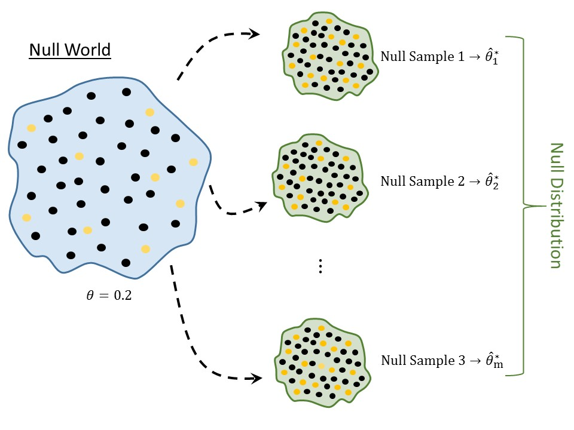

# Quantifying the Evidence (Rejecting Bad Models) {#NullDistns}

Again, the goal of statistical inference is to use the sample as a snapshot of the underlying population (Figure \@ref(fig:nulldistns-statistical-process)).  Recall that there are essentially two categories of questions we ask when trying to perform inference:

  - Estimation: for example, what _proportion_ of volunteers who clean wildlife following an oil spill experience adverse respiratory symptoms?
  - Model Consistency: for example, is it reasonable that no more than 1 in 5 volunteers who clean wildlife following an oil spill experience adverse respiratory symptoms?

```{r nulldistns-statistical-process, echo=FALSE, ref.label="basics-statistical-process", fig.cap="Illustration of the statistical process (reprinted from Chapter 1)."}
```

In the previous chapter we addressed these questions through the use of confidence intervals --- by specifying reasonable values of the parameters through a model of the sampling distribution.  However, when working with questions of the second type (model consistency), there is a second approach; this latter approach is useful when confidence intervals cannot be constructed for the particular question of interest (see Unit 3).

Remember, assessing model consistency is similar to performing a trial in a court of law.  After gathering the evidence, the jury is left with the following decision:

  - Assuming the defendant is innocent, if the evidence is unlikely to have occurred (so the evidence is not consistent with innocence), then they vote "guilty."
  - Assuming the defendant is innocent, if the evidence is reasonably likely to have occurred (so the evidence is consistent with innocence), then they vote "not guilty."
  
The goal in this section is to somehow quantify the evidence against a particular model to determine if we can say that the data is not consistent with the given model.  


## Some Subtleties
In a U.S. trial, there are some subtleties that we should be aware of, as they also creep up in statistical analyses and have implications for how we interpret statistical results.  First, the jury weighs the evidence _under the assumption of innocence_.  That is, they first develop a working hypothesis (the defendant is innocent).  Then, the likelihood of the evidence _under this assumption_ is determined.  For example, if a defendant were innocent of murder, it is unlikely to have five eye witnesses stating the defendant was seen standing over the victim, holding the murder weapon, and screaming "I killed him!"  Since that evidence does not jive with innocence, the jury convicts.  If, however, the only evidence is that five eye witnesses place the defendant in the same city as the victim and the defendant matches the description of someone seen fleeing the crime scene, then the jury would not convict.  Why?  Because the evidence, while pointing toward guilt, is not overwhelming; these things could have happened by chance alone.  Therefore, the evidence, while consistent with guilt does not provide evidence for guilt.

As in the previous chapter, we are making a distinction between "evidence for" a hypothesis and the data being "consistent with" a hypothesis.  Evidence for a particular claim is only established by providing evidence against the opposite statement.  However, consistency can be established without disqualifying any other statement; that is, data can be consistent with two opposing claims, but data cannot provide evidence for two opposing claims.

Also notice that a jury saying "not guilty" is not the same as saying "innocent."  That is, a lack of evidence to convict does not imply the defendant is innocent.  A lack of evidence is simply a lack of evidence.  The defendant may still be guilty, but the evidence has just not proven it.  

Similarly, when assessing model consistency, we will weigh the data _under the null hypothesis_ (our working assumption).  Then, the likelihood of our data occurring by chance alone _under this hypothesis_ is determined.  If that likelihood is small (data is not consistent with the null hypothesis), we can conclude the data supports the alternative hypothesis (guilty).  If, however, that likelihood is large (data is consistent with the null hypothesis), we can only conclude that the data is consistent with the hypotheses.  We are _not_ able to say "supports the null" because that would be like saying a defendant is innocent.  We can't prove innocence because we started by assuming it!


## Assuming the Null Hypothesis
Consider the question we have been asking regarding the [Deepwater Horizon Case Study](#CaseDeepwater):

  > Is there evidence that more than 1 in 5 volunteers assigned to clean wildlife develop adverse respiratory conditions?
  
Remember, we framed this question through statements about a parameter in Chapter \@ref(Questions):
  
  > $H_0:$ the proportion of volunteers assigned to clean wildlife who develop adverse respiratory symptoms is no more than 0.20.  
  > $H_1:$ the proportion of volunteers assigned to clean wildlife who develop adverse respiratory symptoms exceeds 0.20.
  
Within the sample we observed that 27.8% of volunteers experienced adverse symptoms, which is certainly more than the 0.20; therefore, the data is at least trending toward the alternative hypothesis.  However, it is also possible that we just have a strange sample; that is, it is possible our data is a fluke, resulting in an estimate larger than 0.2 by chance alone.  As we discussed in the previous chapter, we expect our estimate to vary to some degree from one sample to another.  Essentially, we need to know if 27.8% of volunteers experiencing symptoms is a strong signal that the rate within the popoulation is larger than 0.2 (1 in 5) or whether 27.8% is simply a fluke that might happen due to sampling variability.  While we are going to be attacking the question differently in this chapter than the previous, we see that the key is still variability in the estimate.  That is, we are back to the _Fourth Fundamental Idea of Inference_.  As stated above, in order to determine evidence for one statement (captured by the alternative hypothesis), we begin by assuming the opposite statement (captured by the null hypothesis) as our working assumption.  That is, if we want to know if 27.8% of volunteers experiencing adverse symptoms is "evidence," we need to figure out what we _expect_ to happen _if only 1 in 5 volunteers actually develop adverse respiratory symptoms_ (the statement represented by the equality portion of the null hypothesis). 

Consider this last statement.  It is equivalent to saying "what type of evidence would we expect for an innocent person?"  Only when we know what to expect can we determine if the evidence in front of us is extreme enough to convict.  Only when we know what to expect can we determine if the observed sample provides evidence in favor of the alternative.  So, we enter a fake world...a world in which exactly 1 in 5 volunteers actually develop respiratory symptoms.  That is, we enter a world in which the null hypothesis is true.  Now, in this world, how do we know what to expect?  We construct the sampling distribution for the proportion under this assumption that the null hypothesis is true; this is known as the __null distribution__.

```{definition, label=defn-null-distribution, name="Null Distribution"}
The sampling distribution of a statistic _if_ the null hypothesis is true.
```

The null distribution, the last in our _Distributional Quartet_, is a sampling distribution; it is just a sampling distribution in a world in which the null hypothesis is true.  As a result, the process for constructing the null distribution is very similar to the process for constructing the sampling distribution (illustrated in Figure \@ref(fig:nulldistns-null-distribution):

  1. Sample randomly from a fake population where the null hypothesis is true.
  2. For each sample, compute the statistic of interest.
  3. Repeat steps 1 and 2 several thousand times.
  4. Plot the statistics retained from each sample.
  
```{r nulldistns-null-distribution, echo=FALSE, fig.cap="Illustration of constructing a null distribution.  Notice the similarity to constructing the sampling distributon."}

```

Notice that these are the same steps as in constructing a sampling distribution with the exception that instead of sampling from the population of interest, we sample from a hypothetical population in which the null distribution is true.  

Since the null distribution is a sampling distribution when a particular hypothesis is true, we are constrained by the same limitations as before.  Namely, we are unable to construct the actual the null distribution; instead, we must construct a model for it.  More, since the null distribution is a sampling distribution, the same techniques we use for modeling the sampling distribution can be modified to model the null distribution.  The key is to enforce the null hypothesis to be true.  As with sampling distributions, we will emphasize the empirical model approach.

Using the computer, we first create a virtual world in which the null hypothesis is true.  This often involves adjusting the original sample in order to make it consistent with having been drawn from a population in which the null hypothesis were true.  The augmented data becomes the null world.  We are then able to bootstrap from the augmented data to simulate what would happen if the null hypothesis were true.  The details of this procedure are beyond the scope of our current discussion; it is more important to understand the conceptual idea of a null distribution at this point.

Figure \@ref(fig:nulldistns-deepwater-null) represents a model for the null distribution of the proportion of volunteers in a sample of 54 assigned to clean wildlife which would develop adverse sympoms when the null hypothesis is that the proportion is 0.20.

```{block2, type="rmdtip"}
A null distribution is tied to a specific null hypothesis.  A sampling distribution does not require a hypothesis to construct.  So, while a sampling distribution could be used to address a variety of null hypotheses, a null distribution can only be used to address the corresponding set of hypotheses for which it was developed.
```

```{r nulldistns-deepwater-null, echo=FALSE, fig.cap="Null distribution for the proportion of volunteers assigned to clean wildlife experiencing adverse respiratory symptoms.  Null hypothesis is that the proportion is 0.20; this is based on a sample of size 54."}
set.seed(201708)
deepwater.null.df <- data_frame(
  Props = rbinom(50000, size = 54, prob = 0.20)/54
)

ggplot(data = deepwater.null.df,
       mapping = aes(x = Props)) +
  geom_histogram(aes(y = ..count../50000), binwidth = 1/54,
                 colour = "black", fill = "grey75") +
  labs(x = "Proportion of Volunteers Experiencing Adverse Symptoms", 
       y = "Relative Frequency") +
  theme_bw(12)
```

As we are introducing the concept of a null distribution, we will stick to modeling the null distribution of a statistic.  Often times in a statistical analysis, the null distribution is computed for a numerical quantity known as a standardized statistic.  These will be discussed more in later units of the text.


## Using the Null Distribution
From the figure, we see that _if the null hypothesis were true_ --- if only 1 in 5 volunteers assigned to clean wildlife experienced symptoms --- then in a sample of 54 individuals, we would expect the proportion who experienced symptoms to be somewhere between 0.1 and 0.3.  _If the null hypothesis were true_, it would be nearly impossible that half of the individuals experienced symptoms (since 0.5 is way off in the tail of the distribution).  The further in the tail region, the more extreme the sample.  The question is then how extreme is our sample?  Again, the null distribution is just setting up expectations; now, we have to weigh the data against those expectations.

In our sample, we observed 27.8% of volunteers who experienced symptoms.  Since 0.278 is towards the center of the distribution, we would say that it is not an extreme sample.  In order to quantify how extreme (or not extreme) it is, we compute the fraction of values which are more extreme (larger in this case) than the value observed; that is, we compute the fraction of values that appear further in the right than 0.278 in the null distribution.  Figure \@ref(fig:nulldistns-deepwater-pvalue) illustrates this computation.  Based on the null distribution, there is a 10.6% chance that _if the null hypothesis were true_ --- only 1 in 5 volunteers actually experienced symptoms --- that in a random sample of 54 volunteers we would obtain data this extreme or more so by chance alone.  Essentially, this tail area is quantifying the strength of the evidence.  The smaller this area, the further in the tail region our data is; that is, the smaller this area, the more unexpected our data.  Therefore, small areas indicate that the data (our evidence) does not jive with our expectations under the null (innocence), forcing us to conclude the data provides evidence _against_ the null hypothesis (guilty verdict).  In our case, since the area is relatively large, our data is consistent with what we might expect if the null were true.  Therefore, in this case, we conclude that there is no evidence that the rate of those experiencing symptoms exceeds 1 in 5.  This area is known as the __p-value__. 

```{r nulldistns-deepwater-pvalue, echo=FALSE, fig.cap="Likelihood of obtaining a sample as extreme or more so as that of the original sample when the parameter of interest is the proportion of volunteers assigned to clean wildlife experiencing adverse respiratory symptoms.  Null hypothesis is that the proportion is 0.20; this is based on a sample of size 54."}
set.seed(201708)
deepwater.null.df <- data_frame(
  Props = rbinom(50000, size = 54, prob = 0.20)/54
)

ggplot(data = deepwater.null.df,
       mapping = aes(x = Props, fill = (Props>=0.27777778))) +
  geom_histogram(aes(y = ..count../50000), binwidth = 1/54,
                 colour = "black") +
  labs(x = "Proportion of Volunteers Experiencing Adverse Symptoms", 
       y = "Relative Frequency",
       fill = "") +
  geom_vline(xintercept = 0.27777778, colour = "red", size = 1.25, linetype = 2) +
  annotate("label", x = 0.4, y = 0.085, label = "Prob = 0.106") +
  scale_fill_manual(values = c("grey75", "red")) +
  guides(fill = "none") +
  theme_bw(12)
```

```{definition, label=defn-pvalue, name="P-Value"}
The probability, assuming the null hypothesis is true, that we would observe a statistic, from sampling variability alone, as extreme or more so as that observed in our sample.  This quantifies the strength of evidence against the null hypothesis.  Smaller values indicate stronger evidence.
```

It is natural to ask "how small does the p-value need to be to prove a statement?"  Like a trial, the weight of the evidence presented depends on the context.  In some studies, a p-value less than 0.01 may be strong evidence while in other studies a p-value less than $10^{-6}$ is required.  And, as in a trial, it is not only the strength of the evidence but the type of evidence presented (DNA evidence may be stronger than fingerprint evidence).  In statistics, it is important to consider the _effect size_ (some measure of the signal in the data) as well as the p-value.  That is, consider whether the difference between the estimate and the null value is actually large; this is always based on subject-matter expertise.  It is often helpful to report a confidence interval alongside a p-value.

```{block2, type="rmdtip"}
While what constitutes "significant" may vary from discipline to discipline, the list below is a good rule of thumb:

  - $p \geq 0.1$: no evidence against the null hypothesis.
  - $0.05 \leq p < 0.1$: weak evidence against the null hypothesis.
  - $0.01 \leq p < 0.05$: some evidence against the null hypothesis.
  - $0.001 \leq p < 0.01$: evidence against the null hypothesis.
  - $p < 0.001$: strong evidence against the null hypothesis.
  
As with any rule of thumb, this should not be considered binding and may vary depending on the application.
```

```{block2, type="rmdtip"}
A p-value should never be reported in isolation.  It should always be accompanied by a confidence interval, a numerical summary of the data, or a graphical summary of the data --- something which indicates the effect size and variability in the data.
```

```{block2, type="rmdtip"}
The following is a general procedure for computing a p-value:
  
  1.  Define the null and alternative hypotheses.
  2.  Construct a model for the null distribution of the desired statistic.
  3.  Compute the desired statistic for the original sample.
  4.  Overlay the statistic from step (3) on the model developed in step (2), and then compute the area under the curve for values _more extreme_ than that observed in step (3).
  
Notice that the definition of a p-value, and this general procedure, apply regardless of the technique used for constructing the model of the null distribution.
```

Like confidence intervals, p-values are often misinterpreted.  In fact, they have become so abused that some researchers argue against their use.  It is our opinion that the p-value can be a useful tool once it is appropriately understood; so, let's dispell some of the misconceptions.  Consider these _incorrect_ statements regarding the p-value obtained for the [Deewater Horizon Case Study](#CaseDeepwater) computed above:

  - There is a 10.6% chance that only 1 in 5 volunteers assigned to clean wildlife will experience adverse symptoms.
  - Since the p-value is large, there is evidence (or the data supports the claim) that 1 in 5 volunteers assigned to clean wildlife will experience adverse symptoms.
  
The first statement incorrectly assumes that there is some chance that the null hypothesis is true.  Remember, our two hypotheses are statements about the parameter.  One is true and other is not.  Our ignorance does not change this; therefore, it does not make sense to talk about the probability of the null being true or false.  Instead, our job is to quantify the likelihood of the data _assuming the null is true_.  The p-value is about the likelihood of the data under a particular model (the null hypothesis).

The second statement makes the common mistake that a lack of evidence for the alternative is evidence in favor of the null.  A lack of evidence is like a "not guilty" verdict.  It simply means we were not convinced.  However, it does not mean that the defendant is innocent.  All we are saying with the large p-value in this case is that the data is _consistent_ with only 1 in 5 volunteers getting adverse symptoms; unfortunately, it is also _consistent_ with more than 1 in 5 volunteers getting adverse symptoms.  This may be an unsatisfying conclusion, but it is still a conclusion nonetheless.  Our conclusion is based on assessing the variability of a the statistic under a particular model.  This is captured in our last of the _Five Fundamental Ideas of Inference_:

```{block2, type="rmdfivefund"}
__Fundamental Idea V__: With a model for the distribution of a statistic under a proposed model, we can quantify the the likelihood of an observed sample under that proposed model.  This allows us to draw conclusions about the corresponding parameter, and therefore the population, of interest.
```


## Sampling Distributions vs. Null Distributions
Clearly the sampling distribution and null distribution of a statistic are closely related.  The difference is that the null distribution is created under a proposed model while the sampling distribution lets the data speak for itself.  It is worth taking just a moment to highlight the differences in the use of these two components of the _Distributional Quartet_.

The sampling distribution is centered on the true value of the parameter; the null distribution is centered on the null value.  Once we assume the null hypothesis is true, we have a value for the parameter; as a result, we expect the sampling distribution under this assumption (that is, the null distribution) to be centered on this hypothesized value.  So, null distributions are _always_ centered on the null value.

Sampling distributions lead to confidence intervals by specifying reasonable values of the parameter.  

Null distributions lead to p-values by quantifying the likelihood of our data under a proposed model.

```{block2, type="rmdtip"}
Model the sampling distribution to construct a confidence interval; to assess a hypothesis the null value is overlayed on the sampling distribution.  Extreme values of the distribution are unreasonable values for the parameter.

Model the null distribution to compute a p-value; to assess a hypothesis, the statistic from the sample is overlayed on the null distribution.  Extreme values of the distribution are values which provide evidence against the null hypothesis.
```
