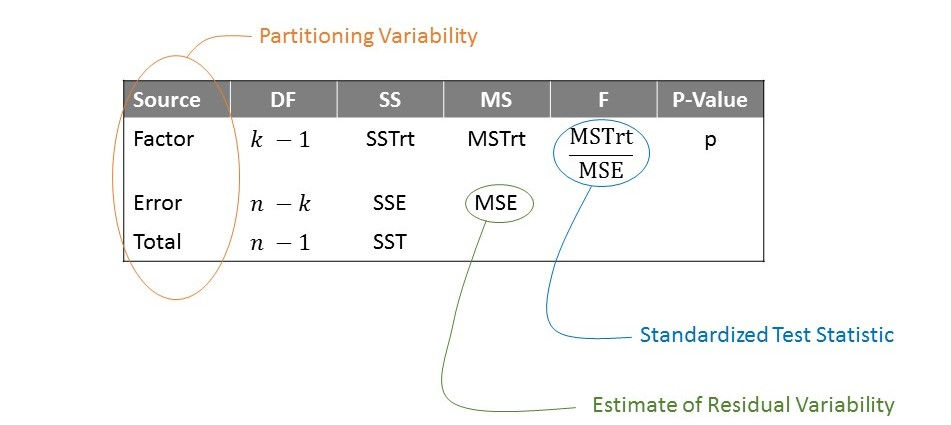

# Classical ANOVA Model {#ANOVAclassical}

In the previous chapter, we developed a model for a quantitative response as a function of a categorical predictor.  Specifically, suppose we are comparing a quantitative response across $k$ levels of a factor of interest.  Our model has the form
$$(\text{Response})_i = \sum_{j=1}^{k} \mu_j \mathbb{I}\left(\text{i-th subject belongs to group j}\right) + \epsilon_i$$

where $\epsilon$ is a random variable capturing the noise in the data-generating process.  In order to perform inference, we made two assumptions on this error term:

  - The error in one observation is independent of the error in any other observation.
  - The variability in the error is constant across groups.
  
This allowed us to empirically model the null distribution of our standardized test statistic
$$T = \frac{MSTrt}{MSE}$$
through simulation.  This approach is completely valid; however, it has been shown that such empirical models can be unstable in small sample sizes.  When we do not have the resources to obtain a large sample, we can improve our model of the sampling distribution (or null distribution) of a statistic through additional modeling assumptions.  In this unit, we discuss an additional modeling assumption that is common in the engineering and scientific disciplines.


## Modeling the Population
Before we delve into the details, let's set the stage for the bigger story being told.  Recall that our goal is to say something about the population using a sample.  We have developed a process to address this goal:

  1. Frame our question through a parameter of interest.
  2. Collect data that allows us to estimate the parameter using the analogous statistic within the sample.
  3. Summarize the variability in the data graphically.
  4. Quantify the variability in the statistic through modeling the sampling distribution (or null distribution).
  5. Using the sampling distribution (or null distribution), quantify the evidence in the sample.
  
This process is wrapped up in our _Five Fundamental Ideas of Inference_ and the _Distributional Quartet_.  The key step in this process is quantifying the variability by modeling the _sampling distribution_ (or _null distribution_).  We have described the construction of these models empirically, through repeating the study by appropriately resampling the data available.

Our goal is still to model the sampling distribution (or null distribution); that is the key inferential step.  Instead of building an empirical model, we can construct an analytical (exact) model through an additional step: modeling the population directly.

```{block2, type="rmdkeyidea"}
A model for the sampling distribution of a statistic can often be obtained by placing a model on the distribution of the population.
```

So, we have two models; the model for the distribution of the population is simply a stepping stone to what we really need, a model for the sampling distribution of the statistic.  It is important to separate these steps.  We are not interested in directly modeling the population; we do it in order to construct a model for the sampling distribution.  

There is one other distinction to make: a model for the population is _always_ an assumption.  We hope that the data is consistent with this assumption in order to apply the resulting model for the sampling distribution.


## Adding the Assumption of Normality
The sub-field of mathematics known as probability is the discipline of modeling randomness.  In particular, we make use of probability to model a distribution.  In order to get a feel for probability models, consider the following example.

```{example, label=ex-iris, name="Iris Characteristics"}
The discipline of statistics began in the early 1900's primarily within the context of agricultural research.  Edgar Anderson was a researcher investigating the characteristics of the iris.  He had collected measurements on over one hundred iris flowers, including their petal length and width and their sepal length and width.  The sepal is the area (typically green) beneath the petal of a flower.  It offers protection while the flower is budding and then support for the petals after the flower blooms.
```

Figure \@ref(fig:anovaclassical-iris-histogram) is a histogram of the sepal width for the iris plants observed by Edgar Anderson; overlayed is the density estimate for the same dataset which we have described as a smoothed histogram.  This smoothed histogram is estimated from the data; it is an empirical model of the distribution.

```{r anovaclassical-iris-histogram, echo=FALSE, fig.cap="Summary of the distribution of sepal widths for a sample of irises."}
ggplot(data = iris,
       mapping = aes(x = Sepal.Width)) +
  geom_histogram(aes(y = ..density..), binwidth = 0.25, colour="black", 
                 fill="grey75") +
  geom_density(colour = "black") +
  labs(x = "Width of the Sepal (cm)") +
  theme_bw(12) +
  theme(axis.title.y = element_blank(),
        axis.ticks.y = element_blank(),
        axis.text.y = element_blank())
```

Probability models are analytical models for the distribution of a variable.  Instead of constructing a density using data, we probability theory posits a functional form for the density (subject to certain constraints that are beyond the scope of this course).  For example, Figure \@ref(fig:anovaclassical-iris-normal) overlays the following function on top of the the iris data:

$$f(x) = \frac{1}{\sqrt{0.380\pi}} e^{-\frac{1}{0.380}(x - 3.057)^2}$$

```{r anovaclassical-iris-normal, echo=FALSE, fig.cap="Summary of distribution  the sepal widths for a sample of irises with a probability model overlayed."}
ggplot(data = iris,
       mapping = aes(x = Sepal.Width)) +
  geom_histogram(aes(y = ..density..), binwidth = 0.25, colour="black", 
                 fill="grey75") +
  geom_density(colour = "black") +
  stat_function(fun = dnorm, colour = "blue", size = 1.1,
                args = list(mean = mean(iris$Sepal.Width), 
                            sd = sd(iris$Sepal.Width))) +
  annotate("segment", x = 3.75, xend = 4, y = 1.1, yend = 1.1,
           color = "black") +
  annotate("segment", x = 3.75, xend = 4, y = 1, yend = 1,
           color = "blue", size = 1.1) +
  annotate("label", x = 4.1, y = 1.1, label = "Empirical",
           hjust = "left") +
  annotate("label", x = 4.1, y = 1, label = "Probability Model",
           hjust = "left") +
  labs(x = "Width of the Sepal (cm)") +
  theme_bw(12) +
  theme(axis.title.y = element_blank(),
        axis.ticks.y = element_blank(),
        axis.text.y = element_blank())
```

While this model for the density is not perfect, we note that it does capture many of the characteristics present in the data.  This particular model, characterized by the bell-shape density, is known as the __Normal Distribution__.

```{definition, label=defn-normal-distribution, name="Normal Distribution"}
Also called the Gaussian Distribution, this probability model is popular for modeling noise within a data-generating process.  It has the following characteristics:

  - It is bell-shaped.
  - It is symmetric, meaning the mean is directly at its center.
  - Often useful for modeling natural phenomena or sums of measurements.
  
The functional form of the Normal distribution is
$$f(x) = \frac{1}{\sqrt{2\pi\sigma^2}} e^{-\frac{1}{2\sigma^2}(x - \mu)^2}$$

where $\mu$ is the mean of the distribution and $\sigma^2$ is the variance of the distribution.
```

While there are several nice properties of the Normal Distribution, we are primarily interested in the fact that if we assume the error in a data generating process follows a Normal Distribution, then we have an analytical model for the sampling distribution of our standardized test statistic.  What does this get us?  We avoid simulating in order to build a model for the sampling distribution; so, computationally it is faster.  If the errors really are from a Normal Distribution, then we also gain power in our study.  Finally, such a model does not rely on sufficient data to construct; it is valid for any sample size (of course, large samples will always decrease variability which is a plus).

So, in addition to the two assumptions we have been willing to make so far, if we also include the assumption that the errors follow a Normal Distribution, we have the "Classical ANOVA Model."

```{block2, type="rmdtip"}
"Classical ANOVA Model": For a quantitative response and categorical variable, the classical ANOVA model assumes the following data-generating process:

$$(\text{Response})_i = \sum_{j=1}^{k} \mu_j \mathbb{I}(\text{i-th observation belongs to j-th group}) + \epsilon_i$$

where 

  1. The errors are independent of one another.
  2. The errors from one group have the same variability as all other groups.
  3. The errors follow a Normal Distribution.
  
It is possible to relax these assumptions; however, this is the default "ANOVA" analysis implemented in the majority of statistical packages.
```


## Impact of Normality Assumption
If all three of the classical ANOVA conditions on the error hold, then we have an analytical model for the distribution of our standardized test statistic
$$T = \frac{MSTrt}{MSE}$$

under the null hypothesis.  That is, we can model the null distribution.  Figure \@ref(fig:anovaclassical-organic-model) compares the empirical model for the null distribution of the standardized test statistic using the data from the [Organic Food Case Study](#CaseOrganic) with that implied by assuming the errors follow a Normal Distribution.  The two models line up quite nicely; we present this as a proof of concept that these assumptions can often be reasonable.

```{r anovaclassical-organic-model, echo=FALSE, cache=TRUE, fig.cap="Comparison of the empirical model for the null distribution of our standardized test statistic with the probability model under the classical ANOVA model."}
set.seed(201709)

# Fit Initial Models
fit.h1 <- lm(moral_avg ~ Food_Condition, data = organic.df)
fit.h0 <- lm(moral_avg ~ 1, data = organic.df)

# Compute Test Stat
organic.aov <- anova(fit.h0, fit.h1)

# Construct Bootstrap Models
F.boot <- boot_model(fit.h1, fit.h0, method="residual", constant.var = TRUE)

ggplot(data = F.boot,
       mapping = aes(x = statistic)) +
  geom_density(color = "black", fill = "grey75", size = 1.1, alpha = 0.5) +
  stat_function(fun = df, args = list(df1 = organic.aov$Df[2],
                                      df2 = organic.aov$Res.Df[2]),
                color = "blue", size = 1.1) +
  labs(x = "Standardized Test Statistic Assuming Null Hypothesis") +
  annotate("segment", x = 2, xend = 3, y = 0.7, yend = 0.7,
           color = "black", size = 1.1) +
  annotate("segment", x = 2, xend = 3, y = 0.6, yend = 0.6,
           color = "blue", size = 1.1) +
  annotate("label", x = 3.25, y = 0.7, label = "Empirical Model",
           hjust = "left") +
  annotate("label", x = 3.25, y = 0.6, label = "Probability Model",
           hjust = "left") +
  coord_cartesian(xlim = c(0, 5), ylim = c(0, 0.75)) +
  theme_bw(12) +
  theme(axis.title.y = element_blank(),
        axis.text.y = element_blank(),
        axis.ticks.y = element_blank())
```

Thus, if we are willing to make the assumption that all three conditions on the error hold, we could rely on the analytical probability model to compute a p-value instead of the empirical model we get from simulation.  This probability model is called the F-distribution, and as a result, the standardized test statistic $T = MSTrt/MSE$ is often referred to as the F-statistic.

Many software packages contain a function for conducting an analysis assuming the classicial ANOVA model is valid.  When this is the case, the output has the form in Figure \@ref(fig:anovaclassical-table).

```{r anovaclassical-table, echo=FALSE, fig.cap="Layout of an ANOVA table which summarizes the analysis conducted.  Emphasis is on partitioning the variability."}

```

The table is a way of summarizing the output from the analysis; the table itself is not very interesting, but we present it because it has the same emphasis we have in this unit --- partitioning variability.  The key to separating a signal from a noise is to partition the variability in the data.  The total variability is partitioned into that resulting from the groups (the factor), this is the deterministic portion of the model that we can explain, and the error, the stochastic portion of the model that we cannot explain.  By partitioning this variability, we are able to compute the standardized test statistic and the corresponding p-value.  Primarily, the only component we examine in such a table is the p-value.  However, it is worth noting that the mean square for error (MSE) also provides an estimate of the variance of the errors within a group, the residual variance.  That is, the MSE provides an estimate of the variance in the response within a group.

```{block2, type="rmdtip"}
The mean square for error (MSE) is an estimate of the variability in the response within a particular group.
```


## Analysis of Organic Food Case Study
Let's consider the [Organic Food Case Study](#CaseOrganic) data.  We will continue working with the model we have developed for the moral expectation score:
$$\text{Moral Expectation Score} \sim \text{Food Exposure Group}$$

Further, let's suppose that the data is consistent with all three classical ANOVA conditions.  The results from the corresponding analysis comparing the average moral expectation score across the three food conditions are given in Table \@ref(tab:anovaclassical-organic-anova-table).

```{r anovaclassical-organic-anova-table, echo=FALSE}
# Compute Analysis
fit.full <- lm(moral_avg ~ Food_Condition, data = organic.df)
organic.aov <- anova(fit.full) %>% tidy()

organic.aov %>%
  rename(Source = term,
         DF = df,
         SS = sumsq,
         MS = meansq,
         F = statistic,
         `P-value` = p.value) %>%
  mutate(Source = recode(Source,
                         "Food_Condition" = "Food Exposure Group")) %>%
  add_row(Source = "Total",
          DF = sum(.$DF),
          SS = sum(.$SS)) %>%
  knitr::kable(digits = 3, caption = "ANOVA table for the Organic Food Case Study.")
```

As long as the conditions on the error term are reasonable, then we can interpret the above p-value.  Based on these results, there is no evidence that the moral expectations differ, on average, across the various food exposure groups.  That is, there is no evidence of a relationship between the type of food to which we are exposed and our resulting moral expectations, on average.


## Recap
By placing an additional condition on the distribution of the error term, we are able to construct an analytical model for the null distribution of the standardized test statistic, instead of requiring an empirical model.  Of course, this model for the distribution of the error terms is an assumption.  In fact, we have made several assumptions in order to compute the p-value given above.  It is unwise to place assumptions on a process without performing some type of assessment to ensure those assumptions are reasonable --- that the data is consistent with the assumptions.  That is the focus of the next chapter.
