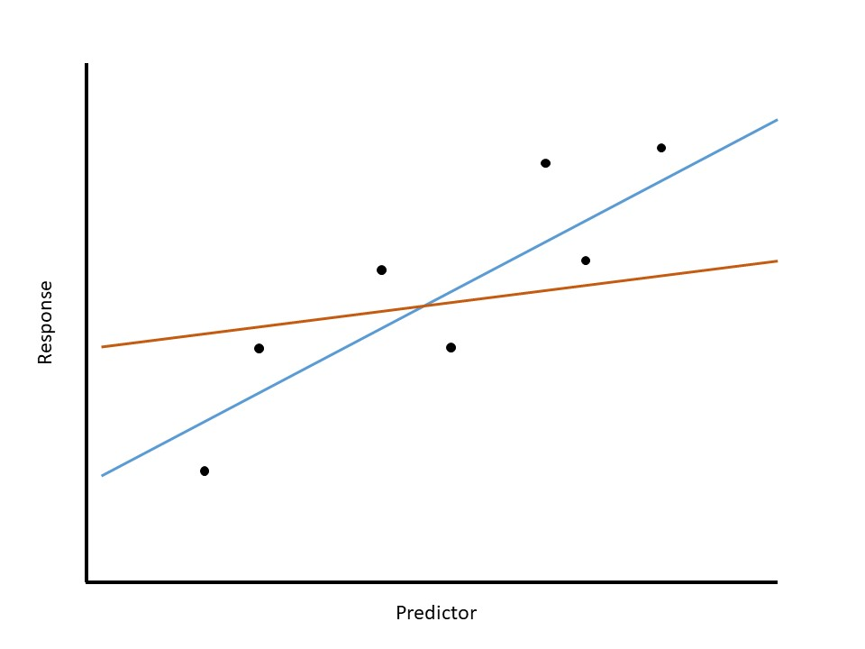

# Building our Statistical Model {#Regmodel}

In Chapter \@ref(#MeanModels) we introduced the statistical modeling framework.  In particular, our general model (see Equation \@ref(eq:general-model)) was given as 

$$\text{Response} = f(\text{variables, parameters}) + \text{noise}$$
As before, this model has two components:

  - A deterministic component which takes the form of a function of variables and unknown parameters.  It is often this component on which we would like to make inference.
  - A stochastic component which captures the unexplained variability in the data generating process.

In the previous unit, we made use of this model, but we only scratched the surface of its potential applications.  In this unit, we begin to explore the full capabilities of such a model.  In particular, we will consider a model in which the deterministic component is a smooth function (specifically, a line) of potentially several variables.  In general, this model building process is known as __regression__.

```{definition, label=defn-regression, name="Regression"}
Used broadly, this refers to the process of fitting a statistical model to data.  More specifically, it is a process of estimating the parameters in a data generating process.
```


## Statistical Model for A Quantitative Response and Quantitative Predictor
Recall that in Chapter \@ref(MeanModels), we described a general model for the data generating process of a quantitative response:

$$\text{Response} = f(\text{predictor variables, parameters}) + \text{noise}$$

While Chapter \@ref(MeanModels) focused on the function $f(\cdot)$ being a constant, this chapter considers alternative formulations.  We believe these models are best discussed in the context of the graphics used to visualize them.  Consider the [Seismic Activity Case Study](#CaseGreece).  Let's begin with a broad question:

  > In general, does the bracketed duration increase as the magnitude increases?
  
As we are interested in predicting the bracketed duration, we will treat it as the response.  In order to imagine what an appropriate model might look like, consider the graphical summary of this relationship.  As we have discussed, we can use a scatter plot to visualize the relationship between the bracketed duration and the magnitude of the corresponding earthquake.  Figure \@ref(fig:regmodel-slr-plot) gives the scatterplot but also overlays a straight line relationship on top of the data.

```{r regmodel-slr-plot, echo=FALSE, fig.cap="Relationship between bracketed duration and the magnitude of an earthquake with a line overlayed on the graphic as a potential explanation of the data generating process."}
fit.greece.slr <- lm(BD02 ~ Magnitude, data = greece.df)
add.on <- greece.df %>%
  filter(Magnitude==5.9) %>%
  mutate(yhat = coef(fit.greece.slr)[1] + Magnitude*coef(fit.greece.slr)[2])

ggplot(data = greece.df,
       mapping = aes(x = Magnitude, y = BD02)) +
  geom_segment(data = add.on, 
               mapping = aes(x = Magnitude, xend = Magnitude,
                             y = yhat, yend = BD02), 
               color = "red", size = 1.2) +
  annotate("label", x = 5.95, y = 14, label = "epsilon",
           color = "red", parse = TRUE) +
  geom_point() +
  geom_smooth(method = "lm", se = FALSE) +
  labs(x = "Moment Magnitude of the Earthquake",
       y = "Bracketed Duration (s) at Measurement Location") + 
  theme_bw(12)
```

Suppose we feel that this line is a good model for the data generating process.  Before proceeding, consider what this statement says.  We are not trying to say that the relationship explains every response we observe.  Instead, the relationship explains the underlying trend --- what happens on average.  While not perfect, this linear relationship at least appears plausible.  Therefore, we replace $f(\cdot)$ in the general form of a data generating process with a simple line, which we express as

\begin{equation}
  (\text{Bracketed Duration})_i = \beta_0 + \beta_1(\text{Magnitude})_i + \epsilon_i
  (\#eq:regmodel-slr)
\end{equation}

where $\beta_0$ represents the intercept of the line and $\beta_1$ the slope.  Now, observe that very few points in Figure \@ref(fig:regmodel-slr-plot) actually fall on the line, which is to be expected.  This emphasizes the idea that the deterministic portion of the model is not meant to fully capture a data generating process since variability is inherent in any process.  This is why statistical models embed a deterministic component alongside a stochastic component --- to capture the variability due to error or noise in the data generating process.  

The model suggests that the bracketed duration at a location is primarily determined by the magnitude of the correpsonding event; however, there is a component we cannot explain.  That is, the model does not explain why, for example, when an earthquake with a magnitude of 5.5 hits, all locations do not have the same bracketed duration.  This noise is picked up by the $\epsilon_i$ term in the model (as illustrated in red on Figure \@ref(fig:regmodel-slr-plot)).  The model essentially says that the bracketed duration for a specific magnitude are simply scattered vertically about the line.  As we saw in Chapter \@ref(MeanModels), we refine this model further by placing additional conditions on the noise term in order to aid in conducting inference.

```{block2, type="rmdtip"}
For a quantitative response and quantitative predictor, the general form of a simple linear regression model is then

$$(\text{Response})_i = \beta_0 + \beta_1(\text{Predictor})_i + \epsilon_i$$
  
```


## Using a Categorical Predictor
We have described the simple linear model in this chapter as one which relates two quantitative variables.  However, this framework can be extended to make use of a categorical predictor.  For example, we saw in Chapter \@ref(Regsummaries) that the bracketed duration for locations with rocky soils could differ from that of locations with other types of soil.  How do we include whether a location has rocky soil or not when this is a categorical variable?  The key is to construct an __indicator variable__.

```{definition, label=defn-indicator-variable, name="Indicator Variable"}
A binary variable (one which takes on a value of 0 or 1) used to represent whether the value for a categorical variable for an observation takes a particular value.
```

Indicator variables essentially create a numeric variable which represents a yes/no decision regarding a categorical variable.  For example, consider the following variable definition:

$$
(\text{Rocky Soil})_i = \begin{cases} 1 & \text{if } i\text{-th location has rocky soil} \\
0 & \text{if } i\text{-th location has a different soil type} \end{cases}
$$

We can then use this variable in our model for the data generating process.  Specifically, consider the following model

\begin{equation}
  (\text{Bracketed Duration})_i = \beta_0 + \beta_1(\text{Rocky Soil})_i + \epsilon_i  
  (\#eq:regmodel-ind)
\end{equation}

You may at first feel the need to have another indicator that takes the value 1 when the soil is not rocky.  But, this is not necessary.  Think of an indicator variable like a "light switch."  The indicator variable turns on when an observation falls into a particular group and turns off otherwise.  So, if you have a location which has "Intermediate" soil conditions, then that location cannot have "Rocky" soil, turning the indicator off.  Setting the indicator to 0 (turning it "off") then leaves only the intercept in the model.  So, the group which has a 0 for the indicator is encoded in the intercept; this is known as the __reference group__. 

```{definition, label=defn-reference-group, name="Reference Group"}
The group defined by setting all indicator variables in a model to 0.
```

The indicator variable essentially creates two mean responses, one for each value of the indicator.For the model in Equation \@ref(eq:regmodel-ind), we have the following:

$$
\begin{aligned}
  \text{Rocky Soil:} &\quad (\text{Bracketed Duration})_i = \beta_0 + \beta_1 + \epsilon_i\\
  \text{Intermediate/Soft Soil:} &\quad (\text{Bracketed Duration})_i = \beta_0 + \epsilon_i
\end{aligned}
$$

So, the "slope" $\beta_1$ is really capturing the shift in the deterministic portion of the model from one group to the other.  This is illustrated in Figure \@ref(fig:regmodel-ind-plot).  The "line" is really connecting the location of the two groups.  

```{r regmodel-ind-plot, echo=FALSE, fig.cap="Comparison of the bracketed duration between locations with rocky soil and those with other soil types."}
greece.df <- greece.df %>%
  mutate(Rocky.Soil = (Soil_Condition=="Rocky"))

add.on <- greece.df %>%
  group_by(Rocky.Soil) %>%
  summarise(Mean = mean(BD02, na.rm=TRUE))

ggplot(data = greece.df,
       mapping = aes(y = BD02, x = Rocky.Soil)) +
  geom_boxplot() +
  geom_point(data = add.on,
             mapping = aes(x = Rocky.Soil, y = Mean),
             size = 4, shape = 18) +
  annotate("segment", x = add.on$Rocky.Soil[1], xend = add.on$Rocky.Soil[2],
           y = add.on$Mean[1], yend = add.on$Mean[2], size = 1.1, 
           color = "blue") +
  labs(x = "",
       y = "Bracketed Duration (s) at Measurement Location") + 
  scale_x_discrete(breaks = c(FALSE, TRUE), 
                   labels = c("Other Soil", "Rocky Soil")) +
  theme_bw(12)
```


## Estimating the Parameters
Recall the goal of statistics --- to use a sample to say something about the underlying population.  There is something intuitive about using the sample mean as an estimate of the population mean; however, now we have a model with both a slope and an intercept and we want to use the data to say something about these parameters.  That process begins by computing an estimate for each of those parameters.

Before describing how such estimates are constructed, let us revisit the model in Equation \@ref(eq:regmodel-slr).  In this equation, both $\beta_0$ and $\beta_1$ are parameters and are therefore unknown values, and they will always be unknown.  We can use available data to estimate these parameters with confidence (confidence intervals) or determine if there is evidence they are outside of a specific region (hypothesis testing), but we will never be able to definitively state the value of these parameters.  As scientists and engineers, many are undoubtedly familiar with a line of "best fit."  We need to keep in mind that any such line is simply an _estimate_; no analysis can actually provide the exact values of $\beta_0$ and $\beta_1$.  But, how are such estimates constructed?

Think about what we would like to do.  We believe there is a linear relationship which generated the data, and we want to use the data to estimate what that relationship looks like.  We want to draw a line through the points that gives the "best fit."  Figure \@ref(fig:regmodel-least-squares) illustrates this for a hypothetical dataset; it compares two _estimated relationships_.  We note that these are just estimates; neither represents the actual line from which the data was generated.  Something inside us knows that the blue line is preferred to the orange line.  The orange line does not seem to represent the pattern in the data because it leaves the cloud of points.  We want a line that goes through the points.  Trying to formalize this, we are saying we want a line that is somehow simultaneously as close to all the data as possible.

```{r regmodel-least-squares, echo=FALSE, fig.cap="Illustration of two competing estimates of a line which runs through the data."}

```

The most widely used method for estimating the parameters is known as "the method of least squares."  For this reason, the estimates are often referred to as the __least squares estimates__.  This method essentially minimizes the amount of error (as measured by the vertical distance a point is from the line) within the dataset.

```{definition, label=defn-least-squares-estimates, name="Least Squares Estimates"}
Often called the "best fit line," these are the estimates of the parameters in a regression model chosen to minimize the sum of squared errors.  Formally, they are the values of $\beta_0$ and $\beta_1$ which minimize the quantity 

$$\sum_{i=1}^n \left((\text{Response})_i - \beta_0 - \beta_1(\text{Predictor})_{i}\right)^2$$

These estimates are often denoted $\widehat{\beta}_0, \widehat{\beta}_1$.
```

This estimation is carried out using statistical software.

Estimation is often associated with statistics.  However, the least squares estimates are actually the result of a mathematical minimization process.  The real statistical aspect comes in when we move back into one of our components of the _Distributional Quartet_.  In particular, the estimates are only useful if we can quantify the variability in those estimates.  In order to construct a model for the sampling distribution of these statistics, we place additional conditions on the stochastic portion of the model.  That is the focus of the next chapter.
