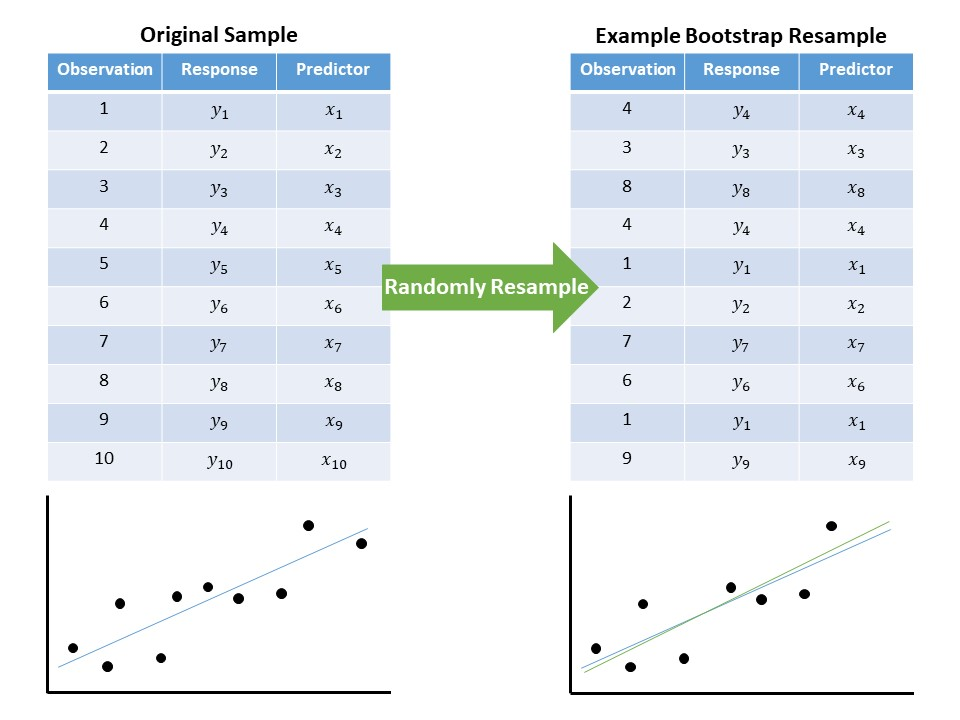

# Conditions on the Error Term of a Regression Model {#Regconditions}

In the previous chapter we developed a general model for generating a quantitative response as a linear function of several predictors:

$$(\text{Response})_i = \beta_0 + \sum_{j=1}^{p} \beta_j (\text{Predictor})_{i,j} + \epsilon_i$$

We also discussed a common method for estimating the parameters of this model from a sample --- the least squares method.  However, if we are to construct a model for the sampling distribution of these estimates we must add some structure to the stochastic component $\epsilon$ in the model.  Just as in the previous unit, the more assumptions we are willing to make, the easier the analysis, but the less likely our model is to be applicable to the actual data-generating process we have observed.  The conditions we make dictate how we conduct inference (the computation of a p-value or confidence interval).


## Classical Regression Model
In this section, we discuss four potential conditions we might place on the stochastic portion of the model.  As we will see, the conditions we consider are extremely similar to those considered in Chapter \@ref(ANOVAclassical).

The first condition we consider is that the noise attributed to one observed individual is independent of the noise attributed to any other individual observed.  That is, the amount of error in any one individual's response is unrelated to the error in any other response observed.

The second condition that is typically placed on the distribution of the errors is that the variability of the responses is similar for every value of the predictor variables (homoskedasticity).  This generalizes the way we characterized the condition in the ANOVA model; the primary difference is that in ANOVA, we had a finite number of groups over which the variance had to remain constant.  Now, we are asking the variability about the regression line to be constant for all values of the predictors.

The third condition is that errors follow a Normal distribution.  Given the shape of the Normal distribution, this condition implies that some responses will tend to fall above the line (we will underpredict for these observations), and some responses will tend to fall below the line (we will overpredict for these observations).  Assuming this condition holds adds a lot of structure to the errors and gets toward modeling the distribution of the population, as we did in ANOVA.

The fourth condition, which is the most important, is that for every value of the predictor, the average error is 0.  This acondition implies that the model we have posited for the data generating process is accurate.  That is, the form of the model is appropriate.  The reason we say this is the most important condition is that while we have methods for conducting an analysis while relaxing the remaining three conditions, if this condition is violated, it says that your model is wrong and you need to essentially start over in developing the model.

If you assume all four of these conditions, we have what we refer to as the "Classical Regression Model."

```{block2, type="rmdtip"}
"Classical Regression Model": For a quantitative response and $p$ predictors (which could include indicators to represent a categorical variable), the classical regression model assumes the following data-generating process:

$$(\text{Response})_i = \beta_0 + \sum_{j=1}^{p} \beta_j (\text{Predictor})_{j,i} + \epsilon_i$$

where 

  1. The errors have a mean of 0 for all values of the predictors.
  2. The errors are independent of one another.
  3. The errors have the same variability for all values of the predictors.
  4. The errors follow a Normal Distribution.
  
It is possible to relax these assumptions; however, this is the default "regression" analysis implemented in the majority of statistical packages.
```

We have stressed the implications of each condition.  Figure \@ref(fig:regconditions-assumptions) illustrates these conditions for the case of a single quantitative predictor.  The condition that the errors have mean 0 implies that for a given value of the predictor, the average response is given by the line (shown as the green dot in the figure).  The condition of Normality implies that for a given value of the predictor, the response is distributed evenly about the regression line, with some above and some below.  Further, the shape of the Normal distribution implies that these responses will cluster about the line.  The condition of homoskedasticity implies that while the responses vary around the line, they do so the same degree, regardless of the value of the predictor.  Therefore, the model is just as precise for all values of the predictor.  Finally, any two responses must be unrelated.

```{r regconditions-assumptions, echo=FALSE, fig.cap="Illustration of the conditions on the error term for the classical regression model."}
knitr::include_graphics("./images/RegConditions-Assumptions.jpg")
```

As with ANOVA, these conditions will allow us to easily model the sampling distribution of our estimates, which is the critical step in developing any type of inference.  In the previous chapter, we considered the following model for the bracketed duration:

$$(\text{Bracketed Duration})_i = \beta_0 + \beta_1(\text{Magnitude})_i + \epsilon_i$$

This model was used to assess the marginal relationship between the bracketed duration and the magnitude overall.  Our hypotheses of interest which captures the question of interest was

  > $H_0: \beta_1 = 0$  
  > $H_0: \beta_1 \neq 0$
  
Using the method of least squares, we estimated the parameters in the model; this leads to the following equation for predicting the bracketed duration given the magnitude:

```{r regconditions-slr-fit, echo=FALSE}
fit.greece.slr <- lm(BD02 ~ Magnitude, data = greece.df)
```

$$(\text{Brackted Duration}) = `r round(coef(fit.greece.slr)[1], 2)` + `r round(coef(fit.greece.slr)[2], 2)`(\text{Magnitude})$$

Most statistical software packages will present the fit through a table which contains the parameter estimates as well as additional information regarding the parameter estimates.  Table \@ref(tab:regconditions-slr-summary) summarizes the fit for the above model.  The p-values which are included are always testing if the corresponding parameter is equal to 0.  Based on the results, we have strong evidence that the slope coefficient associated with the magnitude differs from 0; that is, we have strong evidence ($p < 0.001$) of a relationship between the bracketed duration and the magnitude of the earthquake.  Further, our data is consistent with this coefficient being in the range of (3.05, 5.917) based on the 95% confidence interval.

```{r regconditions-slr-summary, echo=FALSE}
fit.greece.slr %>%
  tidy() %>%
  cbind(confint_tidy(fit.greece.slr)) %>%
  mutate(p.value = ifelse(p.value>=0.001, round(p.value, 3), "< 0.001")) %>%
  select(Term = term,
         Estimate = estimate,
         `Standard Error` = std.error,
         `Lower 95% CI` = conf.low,
         `Upper 95% CI` = conf.high,
         `P Value` = p.value) %>%
  knitr::kable(digits = 3, caption = "Summary of the linear model fit relating the bracketed duration at locations in Greece following an earthquake with the magnitude of the event.")
```

In addition tot he estimate, a confidence interval and p-value associated with testing whether the parameter is equal to 0, the ouptut also includes the __standard error__ of the estimate.  This is a measure of the variability in the estimate; it is standard deviation associated with the sampling distribution of the statistic.  This is used in the analytical formulas for computing the confidence intervals and p-values reported in the table.

```{definition, defn-standard-error, name="Standard Error"}
The estimated standard deviation of a statistic; it quantifies the variability in the sampling distribution of the statistic.
```


## Interpretation of the Parameters
Each of the conditions from the classical regression model can be relaxed, with the exception of the condition that the errors have an average of 0 for all values of the predictors.  Not only does this ensure that the model is correctly specified, but it also provides an interpretation for the parameters.  If the errors are not biasing the average response (since on average, they have a value of 0), then we are able to say that the determinisic portion of our model is giving the _average_ response.

```{block2, type="rmdkeyidea"}
The deterministic portion of a regression model specifies the _average_ value of the response given the value(s) of the predictor(s).
```

As an example, consider the [Seismic Activity Case Study](#CaseGreece).  Specifically, consider our model which predicted the bracketed duration as a function of both the magnitude of the earthquake and the distance from the location to the center of the earthquake:

$$(\text{Bracketed Duration})_i = \beta_0 + \beta_1(\text{Magnitude})_i + \beta_2(\text{Epicentral Distance})_i + \epsilon_i$$

Using the method of least squares, we are able to estimate the parameters in this model; the deterministic portion of this model is then estimated as

```{r regconditions-mlr-fit, echo=FALSE}
fit.greece.mlr <- lm(BD02 ~ Magnitude + Epicentral_Distance, data = greece.df)
```

$$(\text{Bracketed Duration}) = `r round(coef(fit.greece.mlr)[1],2)` + `r round(coef(fit.greece.mlr)[2],2)` (\text{Magnitude}) + `r round(coef(fit.greece.mlr)[3],2)`(\text{Epicentral Distance})$$

The full fit is summarized in Table \@ref(tab:regconditions-mlr-summary).

```{r regconditions-mlr-summary, echo=FALSE}
fit.greece.mlr %>%
  tidy() %>%
  cbind(confint_tidy(fit.greece.mlr)) %>%
  mutate(p.value = ifelse(p.value>=0.001, round(p.value, 3), "< 0.001")) %>%
  select(Term = term,
         Estimate = estimate,
         `Standard Error` = std.error,
         `Lower 95% CI` = conf.low,
         `Upper 95% CI` = conf.high,
         `P Value` = p.value) %>%
  knitr::kable(digits = 3, caption = "Summary of the linear model fit relating the bracketed duration at locations in Greece following an earthquake with the magnitude of the event as well as the distance the location is from the epicenter of the earthquake.")
```

Using this fit, we are able to estimate the _average_ bracketed duration at a location given the magnitude of an earthquake and the distance it is from the center of the earthquake.  Specifically, following an earthquake with a magnitude of 5.5, a location which is 2 kilometers from the epicenter of the earthquake will experience a bracketed duration of `r round(sum(c(1, 5.5, 2)*coef(fit.greece.mlr)), 2)` seconds, on average.  Remember, the deterministic portion is not trying to explain every single response but the overall trend; we now see that it is doing so by specifying the trend, _on average_.  We do not expect every location which is 2 kilometers away from the epicenter of a 5.5 earthquake to experience `r round(sum(c(1, 5.5, 2)*coef(fit.greece.mlr)), 2)` seconds of strong motion; however, we expect the bracketed duration to vary about this value.

This is huge; it says that when we use a regression model to predict a response, we are actually predicting the _average_ response.  More, we can interpret the parameters themselves.  Let's begin with the intercept term, $\beta_0$.  Notice that in our model above, if we try to predict the bracketed duration for a location where an earthquake occurs (so the distance from the epicenter is 0 kilometers) which has a magnitude of 0, then our least squares estimates predict an average bracketed duration of `r round(coef(fit.greece.mlr)[1] ,2)` seconds.  But, this is the value of $\widehat{\beta}_0$, the estimate for the intercept.  In fact, for any regression model, the intercept $\beta_0$ is the value of the deterministic portion of the model whenever all predictors in the model are set to 0.

```{block2, type="rmdtip"}
The intercept in a regression model $\beta_0$ represents the _average_ response when all predictors in the model are set equal to 0.  Note that this may often be an unreasonable scenario.
```

For our particular example, the estimate of the intercept does not make sense --- what does it mean to have a duration of `r round(coef(fit.greece.mlr)[1], 2)` seconds?  This can often be the case when trying to interpret the intercept term due to what we call __extrapolation__.  We do not have any data on the bracketed duration for locations which are less than a kilometer from the epicenter of an earthquake; nor do we have data on the bracketed duration when an earthquake has a magnitude of 0 as there is no such thing.  Therefore, we are using a model to predict for a region over which the model was not constructed to operate.  This is a lot like using a screw driver to hammer a nail --- we are using a tool to accomplish a task for which it was not designed.  We should not be surprised when it fails.  The primary reason extrapolation is dangerous is that without data in a particular region, we have no support that the model will continue to hold in that region.  For this reason, unless you have strong scientific justification for why a model will hold over all values of the predictor, extrapolation should be avoided.

```{definition, label=defn-extrapolation, name="Extrapolation"}
Using a model to predict outside of a region for which data is available.
```

We have seen that the intercept is the average value of the response when the predictors take the value of 0.  How then do we interpret the coefficients (or slopes) associated with each predictor.  We again use an example.  Let's compare the average bracketed duration for a location which is 5 kilometers away from the epicenter of an earthquake which has a magnitude of 3 and one which has a magnitude of 4:

$$
\begin{aligned}
  \text{Magnitude of 3:} \quad &(\text{Bracketed Duration}) = `r round(coef(fit.greece.mlr)[1],2)` + `r round(coef(fit.greece.mlr)[2],2)` (3) + `r round(coef(fit.greece.mlr)[3],2)`(5) = `r round(sum(c(1, 3, 5)*coef(fit.greece.mlr)), 2)` \\
  \text{Magnitude of 4:} \quad &(\text{Bracketed Duration}) = `r round(coef(fit.greece.mlr)[1],2)` + `r round(coef(fit.greece.mlr)[2],2)` (4) + `r round(coef(fit.greece.mlr)[3],2)`(5) = `r round(sum(c(1, 4, 5)*coef(fit.greece.mlr)), 2)`
\end{aligned}
$$

Notice the two estimates differ by `r round(coef(fit.greece.mlr)[2], 2)` seconds, which is exactly the value of $\widehat{\beta}_1$, the estimate of the coefficient associated with magnitude in our model.  Notice, however, in order to get this difference, we left the epicentral distance the same in both scenarios.  This leads us to observing that `r round(coef(fit.greece.mlr)[2], 2)` seconds is the change in the average bracketed duration when the magnitude increased by 1 unit while the epicentral distance remained the same.

```{block2, type="rmdtip"}
The coefficient (or slope) $\beta_j$ in a regression model associated with the $j$-th predictor represents the _average_ change in the response when the $j$-th predictor is _increased_ by 1 unit, _holding all other predictors constant_.
```

In the previous chapter, we saw that our research questions can be framed in terms of the parameters from the regression model.  The interpretation of these parameters allows us to see that our research questions are characterizing the relationship between the response and the predictor, _on average_.


## Addressing Confounding through our Interpretation
This phrase "holding all other predictors constant" has extreme power.  It is this understanding of how the parameters are interpreted that we are able to take our first steps toward addressing confounding.  For example, consider the model

$$(\text{Bracketed Duration})_i = \beta_0 + \beta_1(\text{Magnitude})_i + \beta_2(\text{Epicentral Distance})_i + \epsilon_i$$

From above, we found that for every kilometer further the epicenter of the earthquake is, we can expect the brackted duration to decrease by `r round(coef(fit.greece.mlr)[3], 2)` seconds, on average.  Someone might argue as follows: "This is not a controlled experiment; therefore, while there is a relationship here, it is possible that what is really happening is that earthquakes which were further away were also smaller in magnitude.  Therefore, it is not the distance that is driving this relationship but the magnitude of the earthquake."  Here, this individual is saying that magnitude is a confounder --- related to both the bracketed duration (response) and the variable of interest (distance from the epicenter).  If we had fit a marginal model, this would be a valid concern.  However, remember our interpretation of $\beta_2$ (and our estimate of it).  Our fit suggests that for every kilometer further the epicenter of the earthquake is, we can expect the bracketed duration to decrease by `r round(coef(fit.greece.mlr)[3], 2)` seconds, on average, _holding the magnitude of the earthquake fixed_.  Therefore, since this estimate is comparing to earthquakes of the same magnitude, magnitude cannot be confounding the relationship observed.  We have isolated the effect of the epicentral distance.

Our solution to confounding is to incorporate the relationship between the confounder and the response into our model.  Then, any remaining variables cannot be affected by the confounder.  Of course this has one major limitation --- we cannot account for any variables which are not recorded.  

There are entire texts devoted to this topic.  Here, we simply emphasize that regression models allow us to control for the confounders we have observed.  The relationships are "adjusted for" these confounders due to the interpretation that a coefficient is the effect "holding all other predictors constant."  Regression models allow us to compare similar groups, which are balanced on these confounders, after the fact (instead of having incorporated these comparisons through the study design).


## Empirical Model for the Sampling Distribution
In Table \@ref(tab:regconditions-mlr-summary), we were able to estimate the decrease in bracketed duration, on average, for each kilometer further that location is from the epicenter of an earthquake while holding the magnitude of the earthquake constant; it is reasonable this average decrease is between 0.036 and 0.118 seconds (95% confidence interval).  However, this estimate is only valid assuming the data is consistent with the conditions of the classical regression model.  What if we are unwilling to make such strong assumptions?  In this section, we discuss a method for making inference under only two of the above conditions:

  - The error in the response for one observation is independent of the error in the response for all other observations.
  - The error in the responses are on average 0 for all values of the predictors.
  
In order to empirically model the sampling distribution of the estimates in our model, we can appeal to bootstrapping as in the first unit.  Specifically, we can resample (with replacement) from the original sample several times.  For each resample, we ensure we select all variables associated with the selected observation.  For this resampled dataset, we compute the least squares fit (see Figure \@ref(fig:regconditions-bootstrap)).  Since the observations have changed, the least squares fit will also change. By repeating this process over and over again, we can obtain a model for how the estimates would change in repeated sampling.

```{r regconditions-bootstrap, echo=FALSE, fig.cap="Illustration of a single iteration of a bootstrap procedure to construct an empirical estimate of the sampling distribution for the estimates of the coefficients in a regression model."}

```

Figure \@ref(fig:regconditions-mlr-bootstrap-plot) shows empirical models for the sampling distribution of the three estimates from the regression model 

$$(\text{Bracketed Duration})_i = \beta_0 + \beta_1(\text{Magnitude})_i + \beta_2(\text{Epicentral Distance})_i + \epsilon_i$$

which was fit and summarized in Table \@ref(tab:regconditions-mlr-summary).  Overlayed in the figure are the analytical models for the sampling distribution of the estimates under the classical regression model.  We notice that the model assuming the classical regression model conditions is not all that accurate in this case; we explore the reasoning behind this in Chapter \@(Regassessment).  For now, suffice it to say that we should rely on the results from an empirical model instead of the analytical model suggested by the classical regression model.  Once we have a model for the sampling distribution, we can construct confidence intervals and begin performing inference.

```{r regconditions-mlr-bootstrap-plot, echo=FALSE, fig.cap="Empirical models for the sampling distribution of the estimates from a regression model explaining bracketed duration as a function of the magnitude of the earthquake and its distance from the measuring location.  Overlayed are the analytical models for the sampling distribution assuming all conditions for the classical regression model."}
# Bootstrap Model
set.seed(201709)
boot.fit <- boot_model(fit.greece.mlr, method="pairwise")

# Plots
p1 <- ggplot(data = filter(boot.fit, term=="(Intercept)"),
             mapping = aes(x = estimate)) +
  geom_density(fill = "grey75", color = "black", size = 1.1) +
  stat_function(data = NULL, mapping = NULL,
                fun = dnorm, args = list(mean = coef(fit.greece.mlr)[1],
                                         sd = sqrt(diag(vcov(fit.greece.mlr)))[1]),
                color = "blue", size = 1.1) +
  labs(x = expression(paste(widehat(beta)[0],"  (Intercept)"))) +
  theme_bw(12) +
  theme(axis.title.y = element_blank(),
        axis.text.y = element_blank(),
        axis.ticks.y = element_blank())

p2 <- ggplot(data = filter(boot.fit, term=="Magnitude"),
             mapping = aes(x = estimate)) +
  geom_density(fill = "grey75", color = "black", size = 1.1) +
  stat_function(data = NULL, mapping = NULL,
                fun = dnorm, args = list(mean = coef(fit.greece.mlr)[2],
                                         sd = sqrt(diag(vcov(fit.greece.mlr)))[2]),
                color = "blue", size = 1.1) +
  labs(x = expression(paste(widehat(beta)[1],"  (Magnitude)"))) +
  theme_bw(12) +
  theme(axis.title.y = element_blank(),
        axis.text.y = element_blank(),
        axis.ticks.y = element_blank())

p3 <- ggplot(data = filter(boot.fit, term=="Epicentral_Distance"),
             mapping = aes(x = estimate)) +
  geom_density(fill = "grey75", color = "black", size = 1.1) +
  stat_function(data = NULL, mapping = NULL,
                fun = dnorm, args = list(mean = coef(fit.greece.mlr)[3],
                                         sd = sqrt(diag(vcov(fit.greece.mlr)))[3]),
                color = "blue", size = 1.1) +
  labs(x = expression(paste(widehat(beta)[2],"  (Epicentral Distance)"))) +
  theme_bw(12) +
  theme(axis.title.y = element_blank(),
        axis.text.y = element_blank(),
        axis.ticks.y = element_blank())


gridExtra::grid.arrange(p1, p2, p3, nrow = 2)
```

While we do not discuss it thoroughly, if interest is in computing a p-value to address he above hypotheses, we can construct a null distribution in a similar fashion as that discussed in Chapter \@ref(ANOVAmodel) in the context of a regression model.


## Recap
We have covered a lot of ground in this chapter, and it is worth taking a moment to summarize the big ideas.  In order to construct a model for the sampling distribution for the estimates of the parameters in the regression model, we took a step back and modeled the data generating process.  Such a model consists of two components: a deterministic component explaining the differences between groups and a stochastic component capturing the noise in the system.

Certain conditions are placed on the distribution of the noise in our model.  With a full set of conditions (classical regression model), we are able to model the sampling distribution analytically.  We can also construct an empirical model for the sampling distribution assuming the data is consistent with fewer conditions.  
