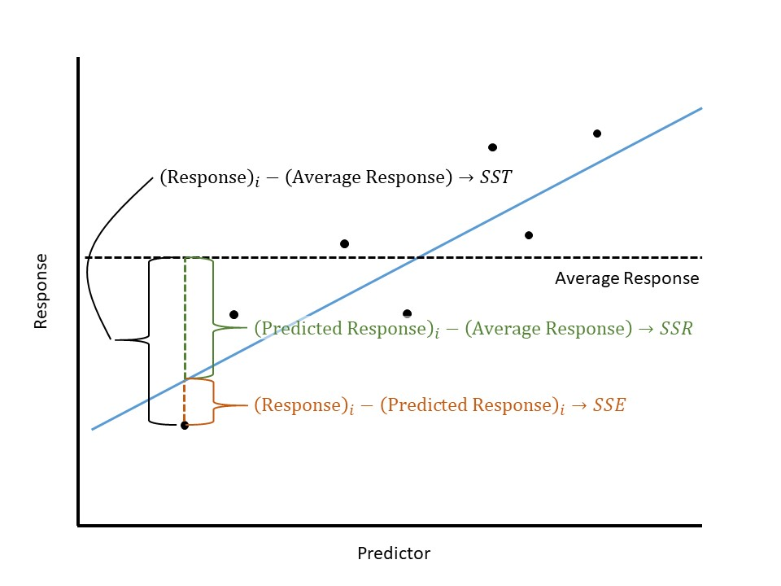

# Quantifying the Quality of a Model Fit {#Regquality}

In the previous two chapters, we described a model for describing the data generating process for a quantitative response as a function of a single quantitative predictor:

$$(\text{Response})_i = \beta_0 + \beta_1 (\text{Predictor})_i + \epsilon_i$$

We can obtain estimates of the unknown parameters in this model using least squares.  Further, under certain conditions on the error term, we are able to construct valid confidence intervals for the parameters.  We have not yet discussed how to compute p-values to test hypotheses about the parameters, nor have we discussed how to determine if our model is useful for making predictions.  It turns out these two tasks are very much related and are accomplished through partitioning variability.  Much of statistics is about accounting for various sources of variability; and, this process allows us to compare models for the data generating process.  In this chapter, we will describe what we mean by partitioning variability and how it is used to derive a measure for the overall performance of a model and to develop a standardized statistic for comparing two models.


## Partitioning Variability
Consider modeling the bracketed duration as a function of the distance the location is from the center of the earthquake:

$$(\text{Bracketed Duration})_i = \beta_0 + \beta_1(\text{Epicentral Distance})_i + \epsilon_i$$

Using least squares to estimate the parameters, and assuming the data is consistent with the conditions for the classical regression model, the resulting model fit is summarized below in Table \@ref(tab:regquality-fit).

```{r regquality-fit, echo=FALSE}
fit.greece.slr2 <- lm(BD02 ~ Epicentral_Distance, data = greece.df)

fit.greece.slr2 %>%
  tidy() %>%
  cbind(confint_tidy(fit.greece.slr2)) %>%
  mutate(p.value = ifelse(p.value>=0.001, round(p.value, 3), "< 0.001")) %>%
  select(Term = term,
         Estimate = estimate,
         `Standard Error` = std.error,
         `Lower 95% CI` = conf.low,
         `Upper 95% CI` = conf.high) %>%
  mutate(Term = recode(Term, 
                       "Epicentral_Distance" = "Epicentral Distance")) %>%
  knitr::kable(digits = 3,
               caption = "Summary of the model fit explaining the bracketed duration as a function of epicentral distance.")
```

Remember, the goal of the model for the data generating process is to explain why the response is the value we see --- we are essentially explaining why the values of the response differ from one individual to another (its variability).  Consider the model for the data generating process summarized above; it posits two reasons why the bracketed duration is not the same value at each measured location:

  - The locations are located different distances from the epicenter of each earthquake.
  - Additional noise due to measurement error in the bracketed duration or additional natural sources we are unable to explain.
  
Looking at the form of the model for the data generating process, it may seem obvious that there are these two sources of variability --- two sources for why the bracketed duration differs from one individual to another.  However, it is not yet clear how we quantify the amount of variability in each.  We want to quantify the amount of variability in the response that can be attributed to each of these components.  That is, we move forward with a goal of trying to say something like

$$(\text{Total Variability in Bracketed Duration}) = (\text{Variability due to Distance}) + (\text{Variability due to Noise})$$

As we have seen in both Chapters \@ref(Summaries) and \@ref(SingleTestStat), variability can be quantified through considering the "total" distance (squared) the observations are from a common target (the mean response).  That is, the total variability in bracketed duration can be measured by

$$\sum_{i=1}^{n} \left((\text{Bracketed Duration})_i - (\text{Mean Bracketed Duration})\right)^2$$

Notice this quantity is similar to, but not exactly the sample variance.  It measures the distance each response is from the sample mean and then adds these distances up.  This is known as the __Total Sum of Squares__ since it captures the total variability in the response.

```{definition, label=defn-sst, name="Total Sum of Squares"}
Let $y_i$ denote the response for the $i$-th observation and $\bar{y}$ denote the sample mean response.  Then, the Total Sum of Squares (abbreviated SST) is given by

$$SST = \sum_{i=1}^{n} \left(y_i - \bar{y}\right)^2$$

```

We now have a way of quantifying the total variability in bracketed duration; we now want to quantify its two components specified by the model (variability due to epicentral distance and variability due to noise).  In order to capture the variability due epicentral distance, we consider how epicentral distance plays a role in the model for the data generating process: it forms the line which dictates the mean response.  That is, the linear portion in the model $\beta_0 + \beta_1 (\text{Epicentral Distance})$ is the model's attempt to explain how epicentral distance explains the bracketed duration; further, this explanation comes in the form of the average response.  Plugging into this equation then provides a predicted mean response (where we substitute in the least squares estimates for the unknown parameters).  Finding the variability in the bracketed duration due to the epicentral distance is then equivalent to finding the variability in these predicted mean responses:

$$\sum_{i=1}^{n} \left((\text{Predicted Bracketed Duration})_i - (\text{Mean Bracketed Duration})\right)^2$$

This is known as the __Regression Sum of Squares__ as it captures the variability explained by the regression line.

```{definition, label=defn-ssr, name="Regression Sum of Squares"}
Let $\widehat{y}_i$ denote the predicted response for the $i$-th observation and $\bar{y}$ denote the sample mean response.  Then, the Regression Sum of Squares (abbreviated SSR) is given by

$$SSR = \sum_{i=1}^{n} \left(\widehat{y}_i - \bar{y}\right)^2$$

```

Finally, the unexplained noise, $\epsilon$ in our model, is the difference between the response and the regression line.  This essentially considers the variability in the bracketed duration where the average is conditional on the epicentral distance (we use the regression model) instead of computing the average of just the bracketed duration values:

$$\sum_{i=1}^{n} \left((\text{Bracketed Duration})_i - (\text{Predicted Bracketed Duration})_i\right)^2$$

This is known as the __Error Sum of Squares__ as it captures the variability not explained by the model but represented by the error term in the model.

```{definition, label=defn-sse, name="Error Sum of Squares"}
Let $y_i$ denote the response for the $i$-th observation and $\widehat{y}_i$ denote the predicted response for the $i$-th observation.  Then, the Error Sum of Squares (abbreviated SSE, and sometimes referred to as the Residual Sum of Squares) is given by

$$SSE = \sum_{i=1}^{n} \left(y_i - \widehat{y}_i\right)^2$$

```

With some clever algebra, it can be easily seen that the variability does in fact partition into these two components.  This discussion is represented in Figure \@ref(fig:regquality-partition-variability).

```{block2, type="rmdkeyidea"}
The total variability in a response can be partitioned into two components: the variability explained by the predictor and the unexplained variability captured by the error term.  This is represented in the formula

$$SST = SSR + SSE$$

```

```{r regquality-partition-variability, echo=FALSE, fig.cap="Illustration of partitioning the variability of a response using a regression model."}

```


## Hypothesis Testing
Partitioning the variability in a response into two components allows us to conduct hypothesis tests to compare two models.  We will be expanding upon the ideas initially presented in Chapter \@ref(SingleTestStat).  Recall that hypothesis testing is really about comparing two models for the data generating process: a more complex model in which the parameters are free to take on any value, and a restricted model in which the parameters are constrained in some way.  We "fail to reject" the null hypothesis when there is not enough evidence to suggest that the more complex model is needed to explain the variability in the response.  We "reject" the null hypothesis when the data is inconsistent with our expectations under the null hypothesis, suggesting that the more complex model is needed to explain the variability in the response.

Consider the following research question:

  > Is there evidence that the average bracketed duration for a location following an earthquake is linearly related to the distance the location is from the center of the earthquake?
  
If we consider the simple linear model for the data generating process described above, this question can be captured using the following set of hypotheses:

$$H_0: \beta_1 = 0 \qquad \text{vs.} \qquad H_1: \beta_1 \neq 0$$

Again, these hypotheses are really suggesting two separate models for the data generating process:

$$
\begin{aligned}
  \text{Model 1}:& \quad (\text{Bracketed Duration})_i = \beta_0 + \beta_1 (\text{Epicentral Distance})_i + \epsilon_i \\
  \text{Model 0}:& \quad (\text{Bracketed Duration})_i = \beta_0 + \epsilon_i
\end{aligned}
$$

The model under the null hypothesis (Model 0) is simpler because it has less parameters; in fact, while Model 1 says that there are two components (the epicentral distance and noise) contributing to the variability observed in the response, Model 0 says that there is only a single component (noise).  So, we can think of our hypotheses as

$$
\begin{aligned}
  H_0: \text{Model 0 is sufficient for explaining the variability in the response.} \\
  H_1: \text{Model 0 is not sufficient for explaining the variability in the response.}
\end{aligned}
$$

Regardless of which model we choose, the total variability in the response remains the same.  We are simply asking whether the variability explained by the predictor is sufficiently large for us to say it has an impact.  In particular, if the null hypothesis were true, we would expect all the variability in the response to be channeled into the noise ($SST \approx SSE$).  If, however, the alternative hypothesis is true, then some of the variability in the response is explained by the predictor beyond just noise ($SSR > SSE$).  Further, since we have a partition, as we increase the regression sum of squares, the error sum of squares must go down (that variability we are putting into the predictor must come out of the noise).  So, the regression sum of squares is equivalent to the shift in the error sum of squares as we move from the null model to the more complex model.

```{block2, type="rmdkeyidea"}
For a particular dataset, the larger the regression sum of squares, the higher the variability in the response being explained by the predictor in the model for the data generating process.  
```

The regression sum of squares represents our signal.  The larger the value, the more evidence we have that the data is not consistent with the null hypothesis.  However, as we saw in Chapter \@ref(SingleTestStat), we should always examine our signal relative to the noise in the data.  But, we have quantified the noise in the data through the error sum of squares!  It then seems reasonable to consider the standardized statistic

$$\frac{SSR}{SSE}.$$

While this is a reasonable statistic, it is not standardized.  Remember that sums of squares capture variability but are themselves not variances.  If we take a sum of squares and divide by an appropriate term, known as the __degrees of freedom__, we get a true variance term, which turns out to be easier to model analytically.

```{definition, label=defn-df, name="Degrees of Freedom"}
A measure of the flexibility in a sum of squares term; a variance is computed by taking the sum of squares and dividing by the corresponding degrees of freedom.
```

```{block2, type="rmdtip"}
Degrees of freedom are a very difficult concept to grasp, even for those who have been studying statistics for a while.  Here is my way of thinking about them --- they are the difference of available terms to work with.  For example, think about the total sum of squares:
  
$$SST = \sum_{i=1}^{n} \left(y_i - \bar{y}\right)^2$$
  
The first term of the difference has $n$ different values (one response for each observation).  However, the sample mean $\bar{y}$ is just one value.  Therefore, there are $n - 1$ degrees of freedom associated with the total sum of squares.  This is often described as starting out with $n$ estimates (the data), but needing to estimate one parameter (the mean) along the way, leading to $n - 1$.

Similarly, consider the regression sum of squares:
  
$$SSR = \sum_{i=1}^{n} \left(\widehat{y}_i - \bar{y}\right)^2$$
  
While there are $n$ predicted values, they are all generated from the same least squares fit $\widehat{\beta}_0 + \widehat{\beta}_1 (\text{Predictor})_i$ which can be computed from two estimates (that for the intercept and slope).  Therefore, we begin with only 2 unique values.  Again, the sample mean has just one value, leading to $2 - 1 = 1$ degree of freedom associated with the regression sum of squares.

Finally, consider the error sum of squares:
  
$$SSE = \sum_{i=1}^{n} \left(y_i - \widehat{y}_i\right)^2$$
  
We have $n$ initial values (one for each observation).  However, as described above, we only need 2 terms to estimate the predicted values.  So, we have $n - 2$ degrees of freedom associated with the error sum of squares.

Note that $(n - 1) = (2 - 1) + (n - 2)$ in the same way that $SST = SSR + SSE$.
```

The measure of variability determined by taking the ratio of a sum of squares and its associated degrees of freedom is known as a __mean square__.

```{definition, label=defn-ms, name="Mean Square"}
The ratio of a sum of squares and its corresponding degrees of freedom.  Specifically:
  
  - __Mean Square Total (MST)__: estimated variance of the responses; this is the same as the sample variance of the response.
  - __Mean Square for Regression (MSR)__: estimated variance of the predicted responses.
  - __Mean Square Error (MSE)__: estimated variance of the responses about the regression line; this is the same as the estimate of the variability of the errors.

```

Since mean squares are proportional to their corresponding sum of squares, an increase in one is associated with an increase in the other.  We are now ready to define our standardized statistic as the ratio of the mean square for regression with the mean square error.

```{block2, type="rmdkeyidea"}
Consider the simple linear model 

$$(\text{Response})_i = \beta_0 + \beta_1(\text{Predictor})_i + \epsilon_i$$
  
A standardized statistic for testing the hypotheses

$$H_0: \beta_1 = 0 \qquad \text{vs.} \qquad H_1: \beta_1 \neq 0$$
  
is given by

$$T^* = \frac{MSR}{MSE} = \frac{SSR}{SSE/(n-2)}$$
  
```

We should not lose sight of the fact that our standardized statistic is really a result of partitioning the variability and considering the variability explained by the predictor relative to the noise in the response.  Our analysis of these sources of variability is often summarized in a table similar to that represented in Figure \@ref(fig:regquality-ANOVA-Table).

```{r regquality-ANOVA-Table, echo=FALSE, fig.cap="Table for summarizing the partitioning of variability in a regression model."}
knitr::include_graphics("./images/RegQuality-ANOVA-Table.jpg")
```

The last entry in the table is the p-value.  As with any p-value, it is computed by finding the likelihood of getting a standardized statistic as extreme or more than that observed when the null hypothesis is true.  "More extreme" values of the statistic would be larger values; so, the area to the right in the null distribution is needed.  The key step is modeling that null distribution.  This is where the conditions we place on the error term come into play.  Under the classical regression conditions, we can model the null distribution analytically; otherwise, we can rely on bootstrapping to model the null distribution.

Let's return to our question of whether the bracketed duration, on average, is linearly related to the distance a location is from the corresponding earthquake.  From Table \@ref(tab:regquality-anova), we have a larger p-value (computed assuming the data is consistent with the classical regression model).  That is, we have no evidence to suggest that locations further from the center of the earthquake experience bracketed durations which differ from those closer to the center of the earthquake, on average.

```{r regquality-anova, echo=FALSE}
fit.greece.slr2 %>%
  anova() %>%
  tidy() %>%
  mutate(p.value = ifelse(p.value>=0.001, round(p.value, 3), "< 0.001")) %>%
  select(Term = term,
         DF = df,
         `Sum of Squares` = sumsq,
         `Mean Square` = meansq,
         `Standardized Statistic` = statistic,
         `P-Value` = p.value) %>%
  mutate(Term = recode(Term, 
                       "Epicentral_Distance" = "Epicentral Distance")) %>%
  knitr::kable(digits = 3,
               caption = "Analysis of the sources of variability in the bracketed duration as a function of epicentral distance.")
```

```{block2, type="rmdkeyidea"}
Determining if a response is linearly related to a predictor is done by determining if the predictor explains a significant portion of the variability in the response.
```

In this section, we partitioned variability as a way of evaluating the strength of evidence the predictor plays in determining the response.  This begs the question; can we quantify the predictive ability of the model for the data generating process using this same partition?


## R-squared
The key to quantifying the quality of a model for the data generating process is to understand that a partition breaks a whole into smaller, distinct components.  This means that if you put the components back together, you have the whole.  The sums of squares are a method of measuring the variability directly with respect to our partition.  That is, the total variability in the bracketed duration is given by

$$
\begin{aligned}
  SST &= SSR + SSE \\
    &= 85.733 + 3883.708 \\
    &= 3969.44
\end{aligned}
$$

The benefit partitioning variability is that it makes clear the breakdown between the variability in the response that the model is explaining (SSR) versus the variability in the response that cannot be explained (SSE).  We are now in a position to quantify the amount of variability the model is explaining:

$$\text{Proportion of Variability Explained} = \frac{85.733}{85.733 + 3883.708} = 0.0216$$

This is known as the __R-squared__ for the model.  The R-squared value has a very nice interpretation; in this case, it says that only 2.16% of the variability in the bracketed duration at a location is explained by its distance from the center of the corresponding earthquake.

```{definition, label=defn-r-squared, name="R Squared"}
Sometimes reported as a percentage, this measures the proportion of the variability in the response explained by a model.
```

As R-squared is a proportion, it must take a value between 0 and 1.  If 0, that means our model has no predictive ability within our sample.  That is, knowing the predictor does not add to our ability to predict the response any more than guessing.  A value of 1 indicates that our model has predicted all the variability in the response; that is, given the predictor, we can perfectly predict the value of the response.

It may appear that obtaining an R-squared value of 1 should be our goal.  And, in one sense, it is.  We want a model that has strong predictive ability.  However, there is a danger in obtaining an R-squared of 1 as well.  We must remember that variability is inherent in any process.  Therefore, we should never expect to fully explain all of the variability in a response.  George Box (a renowned statistician) once made the following statement [@Box1979]:

  > "Now it would be very remarkable if any system existing in the real world could be exactly represented by any simple model. However, cunningly chosen parsimonious models often do provide remarkably useful approximations. For example, the law $PV = RT$ relating pressure $P$, volume $V$ and temperature $T$ of an 'ideal' gas via a constant $R$ is not exactly true for any real gas, but it frequently provides a useful approximation and furthermore its structure is informative since it springs from a physical view of the behavior of gas molecules.  
  >  
  >  For such a model there is no need to ask the question 'Is the model true?'. If 'truth' is to be the 'whole truth' the answer must be 'No.' The only question of interest is 'Is the model illuminating and useful?'.

The idea here is that we know the model will not capture the data generating process precisely.  Therefore, we should be skeptical of models which claim to be perfect.  For example, consider the two models illustrated in Figure \@ref(fig:regquality-overfit).  The black line has a perfect fit, but we argue the blue line is better.  While the black line captures all the variability in the response for this sample, it is certainly trying to do too much.  In reality, the blue line captures the underlying relationship while not overcomplicating that relationship.  We sacrifice a little quality in the fit for this sample in order to better represent the underlying structure.  The black line suffers from what is known as _overfitting_; the blue line is a more _parsimonious_ model, balancing complexity with model fit.

```{r regquality-overfit, echo=FALSE, fig.cap="Illustration of a parsimonious model compared to one which overfits the data."}
set.seed(201708)
plot.dat <- data_frame(
  x = seq(10),
  y = 5 + x + rnorm(10)
)

ggplot(data = plot.dat,
       mapping = aes(x = x, y = y)) +
  geom_line(size = 1.1) +
  geom_point(size = 6) +
  geom_smooth(method = "lm", se = FALSE, colour = "blue", size = 1.1) +
  labs(x = "Predictor", y = "Response") +
  annotate("segment", x = 1.75, xend = 2.4, y = 14, yend = 14, 
           colour = "black", size = 1.1) +
  annotate("segment", x = 1.75, xend = 2.4, y = 13, yend = 13,
           colour = "blue", size = 1.1) +
  annotate("label", x = 2.5, y = 14, label = "R^2 == 1", 
           parse = TRUE, hjust = "left") +
  annotate("label", x = 2.5, y = 13, label = "R^2 == 0.94",
           parse = TRUE, hjust = "left") +
  theme_bw(12)
#  theme(axis.text = element_blank(),
#        axis.ticks = element_blank()) 
```

Students often ask, "if not 1, how high of an R-squared represents a _good_ model?"  The answer depends a lot on the discipline.  In many engineering applications within a lab setting, we can control much of the external variability leading to extremely high R-squared values (0.95 to 0.99).  However, in biological applications, the variability among the population can be quite large, leading to much smaller R-squared values (0.3 to 0.6).  What is considered "good" can depend on the specific application.

```{block2, type="rmdtip"}
While R-squared is useful for quantifying the quality of a model on a set of data, it should not be used to compare two different models as R-squared always favors more complex models.  There are better methods which adjust for the complexity of the model fit.
```

In addition to the discipline, how you view the R-squared of a model may depend on the goal of the model.  There are generally two broad reasons for developing a statistical model:

  - Explain the relationship between a response and one or more predictors.  This can involve examining the marginal relationship, isolating the effect, or examining the interplay between predictors.
  - Predict a future response given a specific value for the predictors.  
  
If all we are interested in doing is explaining the relationship, we may not be concerned about the predictive ability of the model.  That is, since our goal is not to accurately predict a future response, we are primary concerned with whether we have evidence of a relationship.  But, if our goal is prediction, we would like that estimate to be precise.  In such cases, a high R-squared is required before really relying on the model we have.

Regardless of our goal, conducting inference or predicting a future response, partitioning the variability is a key step.  If inference is our primary aim, this partitioning allows us to determine if a predictor adds to the model above and beyond the error alone.  If prediction is our primary aim, the partitioning allows us to quantify the quality of the model.
