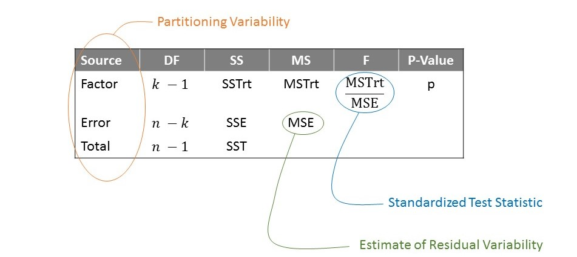

# Quantifying the Evidence {#ANOVAteststat}

Figure \@ref(fig:anovateststat-boxplots) displays a numeric response across three groups for two different datasets.  Consider the following question:

  > For which dataset is there _stronger_ evidence that the response is associated with the grouping variable?

```{r anovateststat-boxplots, echo=FALSE, fig.cap="Simulated data illustrating that signal strength is determined by partitioning variability. There is a clear signal (difference in the location across groups) for Dataset A but not for Dataset B."}
set.seed(20170828)

dat <- data_frame(
  dataset = rep(c("Dataset A", "Dataset B"), each = 90),
  group = rep(c("Group I", "Group II", "Group III"), each = 30, times = 2),
  mids = rep(c(5, 6, 7), each = 30, times = 2),
  halfrange = rep(c(1, 5), each = 90),
  y = runif(180, min = mids - halfrange, max = mids + halfrange)
)

dat <- dat %>%
  group_by(dataset, group) %>%
  mutate(y = scale(y, center=TRUE, scale=FALSE),
         y = y + mids) %>%
  ungroup()

ggplot(data = dat,
       mapping = aes(x = group, y = y)) +
  geom_boxplot() +
  labs(x = "", y = "Response") +
  theme_bw(12) +
  facet_wrap(~ dataset)
```

Nearly everyone will say that Dataset A provides stronger evidence of a relationship between the grouping variable and the response.  We generated these data such that the mean for Groups I, II and III are 5, 6 and 7, respectively, _for both Datasets A and B_.  While there is a difference, on average, in the response across the groups in both cases, it is correct that Dataset A provides stronger evidence for that relationship.  The real question is "what is it that leads everyone to make the same conclusion when we have not yet discussed how to analyze this data?"  When we ask students why they feel Dataset A provides stronger evidence, we typically hear that it is because the "gaps" between the groups "look bigger."  In essence, that is exactly right!


## Partitioning Variability
Subconsciously, when we are deciding whether there is a difference between the groups, we are partitioning the variability in the response.  We are essentially describing two sources of variability: the variability in the response caused by subjects belonging to different groups and the variability in the response within a group (Figure \@ref(fig:anovateststat-partition-variability)).  In both Datasets A and B from Figure \@ref(fig:anovateststat-boxplots), the __between-group variability__ is the same; the difference in the means from one group to another is the same in both cases.  However, the __within-group variability__ is much smaller for Dataset A compared to Dataset B.  

```{r anovateststat-partition-variability, echo=FALSE, fig.cap="Illustration of partitioning the variability in the response to assess the strength of a signal."}
knitr::include_graphics("./images/ANOVATestStat-Partition-Variability.jpg")
```

```{definition, label=defn-between-group-variability, name="Between Group Variability"}
The variability in the average response from one group to another.
```

```{definition, label=defn-within-group-variability, name="Within Group Variability"}
The variability in the response within a particular group.
```

Figure \@ref(fig:anovateststat-boxplots) then illustrates the larger the variability between groups _relative to_ the variability within groups, the stronger the signal.  Quantifying the strength of a signal is then about quantifying the ratio of these two sources of variability.  Let this sink in because it is completely counter-intuitive.  We are saying that in order to determine if there is a difference in the mean response across groups, we have to examine variability.  Further, a signal in data is measured by the variability it produces.  For this reason, comparing a quantitative response across a categorical variable is often referred to as Analysis of Variance (ANOVA).

```{block2, type="rmdkeyidea"}
Consider the ratio of the variability between groups to the variability within groups.  The larger this ratio, the stronger the evidence of a signal provided by the data.
```

This partitioning is a bit easier to visualize here than it was for the simple linear model, but the process is actually exactly the same.


## Forming a Standardized Test Statistic
As we stated above, quantifying the strength of a signal is equivalent to quantifying the ratio of two sources of variability.  This ratio forms our standardized statistic.

Based on our observations above, the standardized test statistic for comparing the mean response across multiple groups has the general form
\begin{equation}
  T = \frac{(\text{Between Group Variability})}{(\text{Within Group Variability})}
  (\#eq:general-test-stat)
\end{equation}


The question we then have before us is the following: how do we measure these sources of variability?  Consider again the hypothesis of interest for the [Oranic Food Case Study](#CaseOrganic):

  > $H_0: \mu_{\text{comfort}} = \mu_{\text{control}} = \mu_{\text{organic}}$  
  > $H_1:$ At least one $\mu$ differs from the others

In order to form the standardized test statistic, let's again think about what constitutes evidence _against_ the null hypothesis.  The more the means differ from one another, the stronger the evidence.  The _between-group_ variability can be measured by the variance of the means; we call this the __Mean Square for Treatment (MSTrt)__.

```{definition, label=defn-mstrt, name="Mean Square for Treatment (MSTrt)"}
This captures the between-group variability in an Analysis of Variance; it is a weighted variance among the sample means from the various groups.  It represents the signal.
```

Since we do not know the mean response for each group (remember, each $\mu$ is a parameter), we assess the between group variability within the sample using the estimates for these parameters --- the sample means.  This is our signal.  The larger this variance, the further apart the means are from one another (providing evidence for the alternative hypothesis); the smaller this variance, the closer the means are (consistent with the null hypothesis).

While the numerator provides some measure of the size of the signal, we need again need to consider how much noise is within the data.  Again, in Figure \@ref(fig:anovateststat-boxplots), the variability between the means is identical for the two datasets; the signal is stronger for Dataset A because this variability is larger _with respect to the noise_.  In order to capture the _within-group_ variability, we pool the variances for each group; this is called the __Mean Square Error (MSE)__.

```{definition, label=defn-mse-alt, name="Mean Square Error (MSE)"}
This captures the within-group variability; it is a pooled estimate of the variance within the groups.  It represents the noise.
```

Our test statistic in Equation \@ref(eq:general-test-stat) is then refined to

\begin{equation}
  T = \frac{MSTrt}{MSE}
  (\#eq:anova-test-stat)
\end{equation}


```{block2, type="rmdtip"}
Consider testing the hypotheses
  > $H_0: \mu_1 = \mu_2 = \dotsb = \mu_k$  
  > $H_1:$ At least one $\mu$ differs from the others
  
The standardized test statistic of interest is

$$
  T = \frac{MSTrt}{MSE}
$$


where 

$$
\begin{aligned}
  MSTrt &= \frac{1}{k-1} \sum_{j=1}^{k} n_j \left((\text{Average response for j-th group}) - (\text{Overall average response})\right)^2 \\
  MSE &= \frac{1}{n-k} \sum_{j=1}^{k} \left(n_j - 1\right) (\text{Variance for j-th group})^2
\end{aligned}
$$

and $n_j$ represents the sample size for the $j$-th group and $n$ the overall sample size.
```

We note that while mathematical formulas have been provided to add some clarity to those who think algebraically, our emphasis is _not_ on the computational formulas as much as the idea that we are comparing two sources of variability.


## Link to Regression Analysis
The standardized statistic described in the previous section should look very familiar.  That is because the ANOVA model is just a special case of a general regression model.  While we developed the statistic intuitively above, we now describe how we reach the same conclusion following the development from a regression perspective.

As discussed in Chapter \@ref(Regquality), we can partition the variability using the sums of squares.  This is true in general, and we can apply it here.

$$
\begin{aligned}
  SST &= SSR + SSE \\
  \sum_{i=1}^{n} \left((\text{Response})_i - (\text{Average Response})\right)^2 &=
    \sum_{i=1}^{n} \left((\text{Predicted Response})_i - (\text{Average Response})\right)^2 \\
    &\qquad + \sum_{i=1}^{n} \left((\text{Response})_i - (\text{Predicted Response})_i\right)^2
\end{aligned}
$$

Now, keeping in mind that the least squares estimates are the sample means for each group, we can say that the "Predicted Response" is actually the sample mean for the group to which the corresponding observation belongs.  Of course, our standardized statistic is constructed using mean squares (actual variances) instead of sums of squares.  In order to compute those mean squares, we must compute the corresponding degrees of freedom, which again partition just as the variability does.

Using the tip described in Chapter \@ref(Regquality) regarding degrees of freedom, we have that the degrees of freedom for the total sum of squares (SST) is $n - 1$ ($n$ unique observations minus a single estimated mean).  The degrees of freedom associated with the regression sum of squares (sometimes called the "Treatment Sum of Squares", abbreviated SSTrt in ANOVA) is $k - 1$ ($k$ averages estimated, one for each group, minus a single overall estimated mean).  Finally, the degrees of freedom associated with the error sum of squares is $n - k$ ($n$ unique observations minus $k$ estimated group means).

We can then form the Mean Square Total $MST = SST/(n-1)$, the Mean Square for Regression (sometimes called the "Mean Square for Treatment," abbreviated MSTrt, as we did in the previous section) as $MSR = SSR/(k-1)$ and the Mean Square for Error as $MSE = SSE/(n-k)$.  We then have the following standardized statistic

$$T^* = \frac{MSR}{MSE} = \frac{SSR/(k-1)}{SSE/(n-k)}$$

which is equivalent to the standardized statistic defined in the previous section.  The key here is that regardless of how we approach the problem, we consider partitioning the variability in order to determine our signal to noise ratio.

Let's not forget that at its heart, when we partition the variability to perform a hypothesis test, we are really comparing two models.  Consider the [Organic Food Case Study](#CaseOrganic).  The primary question of interest is captured by the following hypotheses:

  > $H_0:$ there is no association between the type of food an individual is exposed to and their moral expectations, on average.  
  > $H_1:$ there is is an association between the type of food an individual is exposed to and their moral expectations, on average.
  
which we represented mathematically as

  > $H_0: \mu_{\text{comfort}} = \mu_{\text{control}} = \mu_{\text{organic}}$  
  > $H_1:$ At least one $\mu$ differs from the others

Under the alternative hypothesis, where we place no restrictions on the parameters, we developed the following model for the data-generating process:

$$(\text{Moral Expectation Score})_i = \mu_1 (\text{Group})_{1,i} + \mu_2 (\text{Group})_{2,i} + \mu_3 (\text{Group})_{3,i} + \epsilon_i$$

where

$$
\begin{aligned}
  (\text{Group})_{1,i} &= \begin{cases}
    1 & \text{if i-th subject exposed to organic foods} \\
    0 & \text{if i-th subject not exposed to organic foods} 
    \end{cases} \\
  (\text{Group})_{2,i} &= \begin{cases}
    1 & \text{if i-th subject exposed to comfort foods} \\
    0 & \text{if i-th subject not exposed to comfort foods} 
    \end{cases} \\
  (\text{Group})_{3,i} &= \begin{cases}
    1 & \text{if i-th subject exposed to control foods} \\
    0 & \text{if i-th subject not exposed to control foods}
    \end{cases}
\end{aligned}
$$

The null hypothesis imposes a restriction on the parameters (they must all be the same), which reduces the model for the data generating process to

$$(\text{Moral Expectation Score})_i = \mu + \epsilon_i$$

where $\mu$ is the common value of mean response for each food exposure group ($\mu \equiv \mu_1 = \mu_2 = \mu_3$).  By partitioning the variability, we are really determining if the variability in the moral expectation scores explained by the different groups is a significant portion of all the variability in the moral expectation scores.


## Obtaining a P-value
Standardized statistics quantify the strength of a signal, but they do not allow for easy interpretation.  However, with a standardized statistic, we are able to compute a p-value to quantify how unlikely our particular sample is assuming the null hypothesis were true.  That is, we need to construct a model for the null distribution of the standardized statistic.  We need to know what type of signal we would expect if the null hypothesis were true.  Conceptually, this is no different than it was in Unit I.  We consider running the study again in a world in which all the groups are the same; for the [Organic Food Case Study](#CaseOrganic), this would involve

  1.  Obtaining a new sample of students.  
  2.  Randomizing each student to one of the three groups at random, all showing the same foods.  
  3.  Having each student answer a questionnaire regarding moral dilemmas.
  4.  Summarize the data by computing a standardized statistic.

Notice the difference in step 2 above compared to what actually happened in the real study.  In the real study, each group had a different set of foods.  This was to answer the question about whether there is a difference in the groups.  However, in order to construct the _null distribution_, we need to force all groups to be the same.  This could be accomplished by showing every group the same set of foods.  After repeating the above steps over and over again, we determine how often the recorded standardized statistics exceeded the value of the standardized statistic we obtained in our actual sample.  How this null distribution is modeled depends on the conditions we are willing to place on the error term in our model.

Assuming the data is consistent with the conditions for the classical ANOVA model, we are able to construct an analytical model for the null distribution.  Figure \@ref(fig:anovateststat-pvalue) represents this analytical null distribution of the standardized statistic.  Again, these are values of the standardized statistic we would expect if there were no relationship between the food categories to which the students were exposed and their moral score.  We are then interested in finding out if the observed dataset is consistent with these expectations.

```{r anovateststat-pvalue, echo=FALSE, fig.cap="Computation of the p-value for the Organic Food Case Study under the classical ANOVA model.", cache=TRUE}
fit.organic.h0 <- lm(moral_avg ~ 1, data = organic.df)
f.stat <- anova(fit.organic, fit.organic.h0)$F[2]
p.value <- 1 - pf(f.stat, df1 = 2, df2 = 120)

plot.dat <- data_frame(
  x = seq(0, 6, length.out = 1000),
  y = df(x, df1 = 2, df2 = 120)
)

ggplot(data = plot.dat,
       mapping = aes(x = x, y = y)) +
  geom_area(color = "black", size = 1.25, fill = "grey75") +
  geom_area(data = filter(plot.dat, x >= f.stat),
            color = "black", size = 1.25, fill = "red") +
  labs(x = "Standardized Statistic (MSTrt/MSE)", 
       y = "Density") +
  coord_cartesian(xlim = c(0, 6)) +
  geom_vline(xintercept = f.stat, size = 1.25, colour = "red", linetype = 2) +
  annotate("label", x = 2.5, y = 0.2, label = str_c("p-value = ", round(p.value, 3))) +
  theme_bw(12)
```

Notice that in our data, we observed a standardized test statistic of `r round(f.stat, 2)`; based on the null distribution, we would expect a signal this strong or stronger about `r round(100*p.value, 1)`% of the time _when no signal existed at the population_ (by chance alone).  Our data is very consistent with what we would expect under the null hypothesis.  There is no evidence of a relationship between the type of food a student is exposed to and their moral expectations, on average.

Of course, this p-value was based on assuming the classical ANOVA model.  We could have modeled the null distribution using an empirical model assuming only that the errors were independent of one another (not imposing the conditions of homoskedasticity or normality).  While the model for the null distribution would change under these revised conditions, it changes only slightly (Figure \@ref(fig:anovateststat-compare-nulls)) and the final conclusion remains the same.  How do we determine which p-value to report?  We must assess the conditions, which is the topic of the next chapter.

```{r anovateststat-compare-nulls, echo=FALSE, fig.cap="Comparison of two models for the null distribution of the standardized statistic.  The empirical model for the null distribution is based on 5000 replications.", cache=TRUE}

organic.augmented <- augment(fit.organic, data = organic.df)

# Randomization
set.seed(201808)
f.boot <- replicate(5000, {
  # bootstrap under null
  dat.new <- organic.augmented %>%
    mutate(multiplier = base::sample(c(-(sqrt(5)-1)/2, (sqrt(5)+1)/2),
                                     size = length(.resid),
                                     replace = TRUE,
                                     prob = c((sqrt(5)+1)/(2*sqrt(5)), 
                                              (sqrt(5)-1)/(2*sqrt(5)))),
           y.new = 0 + .resid*multiplier)
  
  anova(update(fit.organic, y.new ~ ., data = dat.new),
        update(fit.organic.h0, y.new ~ ., data = dat.new))$F[2]
})

p.value <- mean(f.boot >= f.stat)

dens <- density(f.boot)
plot.dat.boot <- data_frame(
  x = dens$x,
  density = dens$y
)

ggplot() +
  geom_line(data = plot.dat.boot,
            mapping = aes(x = x, y = density, color = "Empirical Model"),
            size = 1.25) +
  geom_line(data = plot.dat,
            mapping = aes(x = x, y = y, color = "Analytical Model"),
            size = 1.25) +
  coord_cartesian(xlim = c(0, 6)) +
  labs(x = "Standardized Statistic (MSTrt/MSE)", y = "Density", color = "") +
  theme_bw(12) + 
  theme(legend.position = "bottom")
```


## ANOVA Table
We should not lose sight of the fact that our standardized statistic is really a result of partitioning the variability and considering the variability explained by the predictor relative to the noise in the response.  Our analysis of these sources of variability is often summarized in a table similar to that represented in Figure \@ref(fig:anovateststat-ANOVA-Table), known as an ANOVA table.

```{r anovateststat-ANOVA-Table, echo=FALSE, fig.cap="Layout of an ANOVA table which summarizes the analysis conducted.  Emphasis is on partitioning the variability."}

```

This table is extremely familiar as we encountered it in Chapter \@ref(Regquality).  Just as before, the last entry in the table is the p-value.  As with any p-value, it is computed by finding the likelihood of getting a standardized statistic as extreme or more than that observed when the null hypothesis is true.  "More extreme" values of the statistic would be larger values; so, the area to the right in the null distribution is needed as highlighted in the previous section.  

Let's consider the [Organic Food Case Study](#CaseOrganic) data.  Further, let's suppose that the data is consistent with all three classical ANOVA conditions.  The results from the analysis (assuming the classical ANOVA model) comparing the average moral expectation score across the three food conditions are given in Table \@ref(tab:anovateststat-organic-anova-table).

```{r anovateststat-organic-anova-table, echo=FALSE}
# Compute Analysis
fit.organic.alt <- lm(moral_avg ~ Food_Condition, data = organic.df)
organic.aov <- anova(fit.organic.alt) %>% tidy()

organic.aov %>%
  rename(Source = term,
         DF = df,
         SS = sumsq,
         MS = meansq,
         F = statistic,
         `P-value` = p.value) %>%
  mutate(Source = recode(Source,
                         "Food_Condition" = "Food Exposure Group")) %>%
  add_row(Source = "Total",
          DF = sum(.$DF),
          SS = sum(.$SS)) %>%
  knitr::kable(digits = 3, caption = "ANOVA table for the Organic Food Case Study assuming the classical ANOVA model.")
```

As long as the conditions on the error term are reasonable, then we can interpret the above p-value.  Based on these results, there is no evidence that the moral expectations differ, on average, across the various food exposure groups.  That is, there is no evidence of a relationship between the type of food to which we are exposed and our resulting moral expectations, on average.

The table is a way of summarizing the output from the analysis; the table itself is not very interesting, but we present it because it has the same emphasis we have in this unit --- partitioning variability.  The key to separating a signal from a noise is to partition the variability in the data.  The total variability is partitioned into that resulting from the groups (the factor), this is the deterministic portion of the model that we can explain, and the error, the stochastic portion of the model that we cannot explain.  By partitioning this variability, we are able to compute the standardized test statistic and the corresponding p-value.  Practically, the only component we examine in such a table is the p-value.  However, it is worth noting that the mean square error (MSE) also provides an estimate of the variance of the errors within a group, the residual variance.  That is, the MSE provides an estimate of the variance in the response within a group (if we are willing to assume the variability of the errors is the same in each group).

```{block2, type="rmdtip"}
The mean square for error (MSE) is a pooled estimate of the variability in the response within a particular group.
```


## Simulating the Null Distribution
We note that this section is a bit more technical than other sections.  This section seeks to give the reader a feel for the computational aspect of empirically modeling the null distribution.  However, understanding conceptually that we are repeating the study in a world in which the null hypothesis is true is sufficient for interpreting a p-value.

Suppose we are willing to assume the data is consistent with the following two conditions:

  - The error in the response for one observation is independent of the error in the resposne for all other observations.  
  - The errors in the response are identically distributed; specifically, the variability in the error of the response is the same within each group defined by the predictor.

Under these, we can empirically model the null distribution of our standardized statistic.  The key here is to lean on our data generating process.  Consider the [Organic Food Case Study](#CaseOrganic).  _If the null hypothesis is true_, then we have that

$$\mu_{\text{organic}} = \mu_{\text{comfort}} = \mu_{\text{control}}$$

Let's define this common mean to be $\mu$; we do not know what this value is, but it is common to all groups.  Therefore, _if the null hypothesis is true_, we have that the data generating process reduces to

\begin{equation}
  \text{(Moral Expectation Score)}_i = \mu + \epsilon_i
  (\#eq:null-model)
\end{equation}

We can generate data according to this model.  We can replace $\mu$ by our best estimate --- the sample mean response across all observations regardless of their group.  It simply remains to determine how to approximate a random variable from the noise distribution.  In order to do this, we need estimates of the errors --- residuals.  The key is to use the residuals obtained when we fit the _more complex model_:

$$(\text{Moral Expectation Score})_i = \mu_1 (\text{Group})_{1,i} + \mu_2 (\text{Group})_{2,i} + \mu_3 (\text{Group})_{3,i} + \epsilon_i$$

Recall that a residual is the difference between the observed response and the predicted response.  So, in this case, we have that the residual is given by 

$$(\text{Residual})_i = (\text{Observed Moral Expectation Score})_i - (\text{Average moral expectation score for group to which i-th observation belongs})$$

That is, the residual is the difference between the observed response and the sample mean response for the corresponding group to which the observation belongs.  For example, consider the [Organic Food Case Study](#CaseOrganic); the data is reproduced in Figure \@ref(fig:anovateststat-organic-boxplot).  Based on the data available, if a subject were to be exposed to organic foods, we would expect their moral expectation score to be `r round(mean(organic.df$moral_avg, na.rm=TRUE), 2)`; this is the average observed among individuals randomized to this treatment within our study.

The key idea here is that residuals approximate the unseen error.  If we randomly sample the residuals (with replacement), we are constructing a bootstrap sample of "errors" which can be used to form new responses.  Specifically, a new dataset, generated under the null hypothesis, can then be constructed as

$$
(\text{Bootstrap Response})_i^* = (\text{Overall Average Response}) + (\text{Sampled Residual})_i^*
$$

Notice that each newly generated "bootstrap" response has the same mean (so that the null is true).  We then take this new dataset and compute the standardized test statistic as before by fitting the complex model and partitioning the variability (due to the groups and the noise) and record it.  Even though we know there should not be a difference among the groups (since we generated the data), we construct the analysis as if we were searching for such a difference.  We repeat this process over and over again until we have constructed the null distribution.  This gives us a sense of the p-value.


## Recap
By partitioning the variability in the response, we are able to construct a standardized statistic for testing the hypothesis of interest.  The model for the null distribution of this statistic depends upon the conditions we are willing to impose on the stochastic portion of the data generating process.  Regardless of the conditions we impose, we can interpret the resulting p-value similarly.  It provides an indication of whether the data suggests that the average response differs for at least one of the groups.

Of course, the interpretation of the p-value depends on the conditions we impose.  We should not choose such conditions without performing some type of assessment to ensure those conditions are reasonable --- that the data is consistent with the conditions.  That is the focus of the next chapter.
